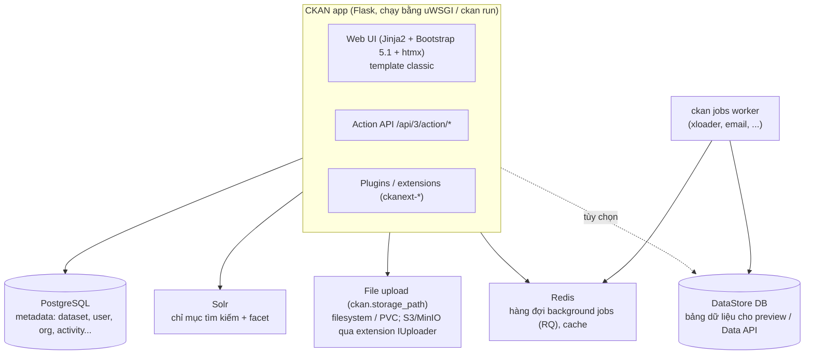

# CKAN 2.11 — Tổng quan kỹ thuật

## CKAN là gì
CKAN là **nền tảng data portal mã nguồn mở**, viết bằng Python/Flask, do Open Knowledge Foundation phát triển. Nhiều cổng dữ liệu mở như data.gov và data.gov.uk dùng CKAN. Nó:
- quản lý **metadata** của dataset;
- lưu file dữ liệu hoặc trỏ tới nơi chứa file;
- cung cấp giao diện tìm kiếm;
- có **Action API** đầy đủ.

**Vị trí so với OpenMetadata trong Lakehouse:**

| | OpenMetadata | CKAN |
|---|---|---|
| Người dùng | Kỹ sư dữ liệu | Người dùng nghiệp vụ, người dùng bên ngoài |
| Nội dung | Schema, lineage, profiling của mọi bảng | Dataset **đã chọn lọc** (Gold), mô tả dễ hiểu, file tải về |
| Cách lấy dữ liệu | Kết nối kỹ thuật | Tải CSV, xem trước, link Trino, API |

## Phiên bản & yêu cầu

Dự án dùng **2.11.6**, bản vá mới nhất của nhánh 2.11, phát hành 2026-08-26. Nhánh 2.11 ra bản đầu (2.11.0) ngày 2024-08-21. Từ 2026-09-11 đến 2026-09-18 dự án từng nhắm 2.12.0; lý do quay lại ở Decision log trong [roadmap](roadmap.md).

| Thành phần | Yêu cầu | Dự án dùng |
|---|---|---|
| Python | ≥ 3.10 (`python_requires >= 3.10`; 2.11.5 bỏ 3.9, thêm 3.13 và 3.14) | 3.12.3 (WSL). Image `ckan-base:2.11.6` dùng **3.10** |
| PostgreSQL | ≥ 12 | 16: bản apt trên WSL local, `postgres:16-alpine` trên cluster |
| Solr | 9, schema phiên bản `2.8`–`2.11` | `ckan/ckan-solr:2.11-solr9` (còn có biến thể `2.11-solr9-spatial` cho tìm kiếm không gian) |
| Redis | Bắt buộc, cổng 6379 | 7 trên cluster, bản apt trên WSL |
| libmagic | Bắt buộc, dùng nhận diện kiểu file upload | `libmagic1t64` (Ubuntu 24.04) |

## Điểm cần biết về 2.11
- **Giao diện**: chỉ có một bộ template gốc là classic (`templates` / `public`, Bootstrap **5.1.3**). Bootstrap 3 đã bị bỏ từ 2.11.0, và `ckan.base_templates_folder` chỉ nhận `templates`. Xem [ckan-theming.md](ckan-theming.md#theme-gốc-classic-q9).
- **htmx** bắt đầu được dùng trong frontend (từ 2.11.0).
- **Hiệu năng template**: dùng tag `` thay cho `{{ h.snippet(...) }}`.
- **DataStore**:
  - Có **Table Designer**: tạo bảng DataStore bằng form, có kiểm tra dữ liệu.
  - Có interface `IDataDictionaryForm`.
  - Nâng cấp từ bản cũ phải chạy `ckan datastore upgrade`.
- **Activity** là plugin riêng (từ 2.10), có migration riêng: phải chạy `ckan db upgrade -p activity`. Từ 2.11 có activity cho cả dataset private.
- **CSRF**: form của core có CSRF từ 2.10. Blueprint của extension mặc định vẫn được miễn (`ckan.csrf_protection.ignore_extensions = true`), nhưng form trong theme vẫn nên có `{{ h.csrf_input() }}`, vì 2.12 bắt buộc.
- **2.11.6** vá 8 lỗ hổng bảo mật (XSS, SQL injection trong DataStore, session fixation…). Đây là lý do ghim đúng bản vá mới nhất.

### Những thứ của 2.12 mà 2.11 **không** có
Tài liệu trước 2026-09-18 có nhắc tới các mục này:
- Theme **Midnight Blue** (`templates-midnight-blue`).
- **File là thực thể độc lập**, tầng storage `ckan.files.*` và extension `ckanext-file-keeper-cloud`. Ở 2.11, upload lưu theo `ckan.storage_path`; muốn đưa lên S3/MinIO thì dùng extension upload kiểu cũ (interface `IUploader`).
- CLI `ckan db check`, `ckan clean activities`, `ckan datastore fts-index`. Ở 2.11, `ckan clean` chỉ có `users`.
- Config `ckan.webassets.debug`, `ckan.datastore.ms_in_timestamp`.
- Các thay đổi phá vỡ của 2.12 cũng **chưa** áp dụng: bảng `PackageExtra`/`GroupExtra` vẫn còn, `IGroupForm` còn API cũ.

## Kiến trúc thành phần



- **Postgres là nguồn sự thật.** Solr chỉ là chỉ mục; mất thì dựng lại bằng `ckan search-index rebuild`.
- **DataStore** là một DB riêng. xloader nạp CSV/XLSX vào đó để có bảng preview và Data API (`datastore_search`, SQL).

## Mô hình dữ liệu

| Khái niệm | Ý nghĩa |
|---|---|
| **Dataset** (`package` trong code) | Đơn vị metadata: title, notes, tags, license, extras… |
| **Resource** | File upload hoặc URL thuộc dataset (CSV, link Trino JDBC, API…) |
| **Organization** | Chủ sở hữu dataset và phân quyền (admin / editor / member). Dataset private chỉ thành viên org xem được |
| **Group** | Nhóm theo chủ đề, xuyên organization |
| **User / Sysadmin** | Sysadmin có toàn quyền và dùng được `/ckan-admin` |
| **API token** | Token cá nhân (JWT) để gọi API ghi |
| **Activity stream** | Lịch sử thay đổi, qua plugin `activity` |
| **Custom fields** | Qua `extras` hoặc schema YAML với **ckanext-scheming** |

## Cấu hình
- File chính: `ckan.ini`, sinh bằng `ckan generate config <path>`. Lệnh này **ghi đè không hỏi** nếu file đã có ([gotchas](gotchas.md) 6n).
- Key hay dùng:
  - Kết nối: `sqlalchemy.url`, `solr_url`, `ckan.redis.url`.
  - Site: `ckan.site_url`, `ckan.site_id`, `ckan.site_title`, `ckan.site_logo`, `ckan.site_description`, `ckan.favicon`.
  - Plugin & ngôn ngữ: `ckan.plugins`, `ckan.locale_default`, `ckan.locales_offered`.
  - Upload: `ckan.storage_path`, `ckan.uploads_enabled`, `ckan.max_resource_size`.
  - Trang chủ: `ckan.featured_orgs`, `ckan.featured_groups`.
  - `debug`.
- Tra cứu: `ckan -c ckan.ini config search <pattern>`, `ckan -c ckan.ini config describe`.
- Override bằng biến môi trường trong container: xem [phase-2](phase-2-docker-packaging.md#image-gốc-ckanckan-base2116--thông-tin-đã-kiểm-chứng).
- Một số key (site title, logo, CSS tùy chỉnh, intro text) chỉnh được ở `/ckan-admin/config`. Giá trị này **lưu trong DB** và ghi đè `ckan.ini`.

## CLI `ckan` hay dùng

```bash
ckan -c ckan.ini run                          # dev server :5000 (reloader bật mặc định; -r để tắt)
ckan -c ckan.ini db init | db upgrade         # tạo / nâng schema
ckan -c ckan.ini db upgrade -p activity       # migration của plugin activity
ckan -c ckan.ini db version                   # revision hiện tại
ckan -c ckan.ini db pending-migrations        # còn migration nào chưa chạy (2.11 không có db check)
ckan -c ckan.ini db clean --yes               # XÓA mọi bảng trong DB
ckan -c ckan.ini sysadmin add <user> email=... name=<user>
ckan -c ckan.ini sysadmin list
ckan -c ckan.ini user add <user> email=...
ckan -c ckan.ini user token add <user> <tên token>   # in ra API token
ckan -c ckan.ini search-index rebuild         # dựng lại chỉ mục Solr
ckan -c ckan.ini jobs worker | jobs list      # background jobs
ckan config-tool ckan.ini "key = value"       # sửa ini từ script (-s DEFAULT cho section [DEFAULT])
ckan -c ckan.ini datastore set-permissions    # in SQL cấp quyền datastore
ckan generate extension -o <dir>              # scaffold ckanext-*
ckan generate config <path>                   # sinh ckan.ini (ghi đè!)
```

## Action API — ví dụ

```bash
BASE=http://localhost:5000/api/3/action
curl "$BASE/status_show"
curl "$BASE/package_search?q=outage&rows=5"
curl "$BASE/package_show?id=<dataset-name>"
# Ghi: cần header Authorization: <API token>
curl -X POST "$BASE/package_create" -H "Authorization: $CKAN_TOKEN" -H 'Content-Type: application/json' \
  -d '{"name":"outage-summary","title":"Outage summary","owner_org":"<org>"}'
curl -X POST "$BASE/resource_create" -H "Authorization: $CKAN_TOKEN" \
  -F package_id=outage-summary -F name=latest.csv -F upload=@latest.csv
```

Với Python, dùng thư viện `ckanapi`: `RemoteCKAN(url, apikey=token).action.package_create(...)`. Tiện cho DAG Airflow.

## Extension hữu ích

⚠ **Luôn kiểm tra extension có hỗ trợ 2.11 không** (README, CHANGELOG, CI) trước khi cài, và ghim phiên bản (Q10). 2.11 đã ra từ 2024-08 nên phần lớn extension phổ biến đã hỗ trợ. Cẩn thận với bản mới nhất của một extension: có thể nó đã chuyển hẳn sang 2.12.

| Extension | Dùng khi |
|---|---|
| `ckanext-envvars` | Cấu hình bằng biến môi trường. **Có sẵn** trong ckan-base (v0.0.6) |
| `ckanext-xloader` | Nạp CSV/XLSX vào DataStore (thay DataPusher) |
| `ckanext-scheming` | Schema metadata tùy biến (ví dụ `layer`, `trino_table`, `owner_team`) |
| `ckanext-dcat` | Xuất/nhập DCAT (RDF, JSON-LD), liên thông với portal khác |
| `ckanext-pages` | Trang nội dung tĩnh (Giới thiệu, Hướng dẫn) do admin tự soạn |
| `ckanext-harvest` | Thu thập metadata từ nguồn khác |
| Upload S3/MinIO (ví dụ `ckanext-s3filestore`) | Lưu file upload lên MinIO thay vì PVC. Chưa chọn và chưa kiểm tra hỗ trợ 2.11 |
| Auth: `ckanext-ldap`, `ckanext-saml2auth`, OIDC | Đăng nhập tập trung (Q5) |

## Tài liệu tham khảo
- Docs 2.11: <https://docs.ckan.org/en/2.11/>
- Changelog: <https://docs.ckan.org/en/latest/changelog.html> (mục v.2.11.x)
- Cài từ source: <https://docs.ckan.org/en/2.11/maintaining/installing/install-from-source.html>
- File upload: <https://docs.ckan.org/en/2.11/maintaining/filestore.html>
- Theming: <https://docs.ckan.org/en/2.11/theming/index.html>
- Extension tutorial: <https://docs.ckan.org/en/2.11/extensions/tutorial.html>
- Action API reference: <https://docs.ckan.org/en/2.11/api/index.html>
- Config reference: <https://docs.ckan.org/en/2.11/maintaining/configuration.html>
- Docker: <https://github.com/ckan/ckan-docker-base> (thư mục `ckan-2.11`), <https://github.com/ckan/ckan-docker> (repo tham chiếu, dùng 2.11)
- Source template: <https://github.com/ckan/ckan/tree/ckan-2.11.6/ckan/templates>
