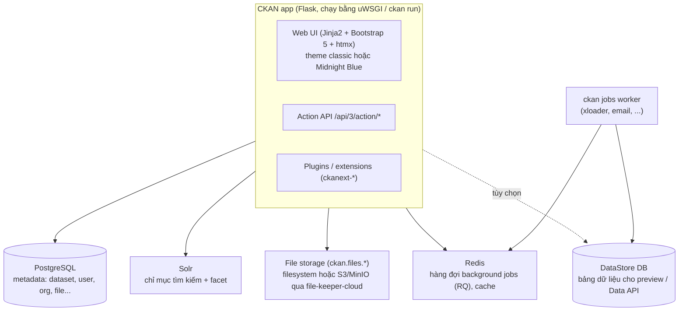

# CKAN 2.12 — Tổng quan kỹ thuật

## CKAN là gì
CKAN là **nền tảng data portal mã nguồn mở**, viết bằng Python/Flask, do Open Knowledge Foundation phát triển. Nhiều cổng dữ liệu mở như data.gov và data.gov.uk dùng CKAN. Nó:
- quản lý **metadata** của dataset;
- lưu file dữ liệu hoặc trỏ tới nơi chứa file;
- cung cấp giao diện tìm kiếm;
- có **Action API** đầy đủ.

**Vị trí so với OpenMetadata trong Lakehouse:**

| | OpenMetadata | CKAN |
|---|---|---|
| Người dùng | Kỹ sư dữ liệu | Người dùng nghiệp vụ, người dùng bên ngoài |
| Nội dung | Schema, lineage, profiling của mọi bảng | Dataset **đã chọn lọc** (Gold), mô tả dễ hiểu, file tải về |
| Cách lấy dữ liệu | Kết nối kỹ thuật | Tải CSV, xem trước, link Trino, API |

## Phiên bản & yêu cầu

Phiên bản dự án dùng là **2.12.0**, phát hành 2026-08-26.

| Thành phần | Yêu cầu | Dự án dùng |
|---|---|---|
| Python | ≥ 3.10 (`python_requires >= 3.10`) | 3.12.3 (WSL). Image `ckan-base:2.12.0` dùng **3.14** |
| PostgreSQL | ≥ 12 | 16: bản apt trên WSL local, `postgres:16-alpine` trên cluster |
| Solr | 9 | `ckan/ckan-solr:2.12-solr9` (còn có biến thể `2.12-solr9-spatial` cho tìm kiếm không gian) |
| Redis | Bắt buộc, cổng 6379 | 7 trên cluster, bản apt trên WSL |
| libmagic | Bắt buộc, dùng nhận diện kiểu file upload | `libmagic1` |

## Điểm mới của 2.12 đáng chú ý
- **Theme Midnight Blue**: bộ template/asset gốc mới, sẽ thành mặc định từ CKAN 3.0. Xem [ckan-theming.md](ckan-theming.md#chọn-theme-gốc-classic-hay-midnight-blue-q9).
- **File là thực thể độc lập (first-class)**:
  - File có ID, owner, quyền truy cập và URL cố định, quản lý tách khỏi resource.
  - Nội dung file tạo qua API là bất biến: có thể xóa nhưng không sửa được.
  - Tầng storage mới cấu hình qua `ckan.files.storage.<name>.*` và `ckan.files.default_storages.{default,resource,user,group,admin}`.
  - Core **chỉ có adapter filesystem**. S3/MinIO dùng **`ckanext-file-keeper-cloud`** (chỉ hỗ trợ 2.12).
- **DataStore**: phân trang keyset, lọc nâng cao, `datastore_search` nhanh hơn với `next_page`. Có CLI `ckan datastore fts-index`.
- **Hiệu năng**:
  - Tìm kiếm dataset không reload trang.
  - Chỉ validate lại resource khi các trường liên quan thay đổi.
  - Activity chỉ được tạo khi có thay đổi thật.
- **CLI mới**: `ckan db check`, `ckan clean activities`, `ckan datastore fts-index`.
- **Config mới**: `ckan.uploads_enabled` (mặc định `true`), `ckan.webassets.debug` (mặc định `false`), `ckan.datastore.ms_in_timestamp`.
- **Migration notes** (quan trọng khi viết extension hoặc nâng cấp):
  - Form trong extension phải có CSRF (`h.csrf_input()`).
  - Bảng `PackageExtra`/`GroupExtra` đã bị bỏ.
  - `IGroupForm.form_to_db_*`/`db_to_form_*` đã được thay thế.
  - Bỏ `/api/1/snippet` và `ckan.static_max_age`.
  - Email user có unique index không phân biệt hoa thường.
  - Nâng cấp từ bản cũ phải chạy `ckan db upgrade` và cập nhật SQL của DataStore. Dự án này cài mới nên chỉ cần `db init`.

## Kiến trúc thành phần



- **Postgres là nguồn sự thật.** Solr chỉ là chỉ mục; mất thì dựng lại bằng `ckan search-index rebuild`.
- **DataStore** là một DB riêng. xloader nạp CSV/XLSX vào đó để có bảng preview và Data API (`datastore_search`, SQL).

## Mô hình dữ liệu

| Khái niệm | Ý nghĩa |
|---|---|
| **Dataset** (`package` trong code) | Đơn vị metadata: title, notes, tags, license, extras… |
| **Resource** | File upload hoặc URL thuộc dataset (CSV, link Trino JDBC, API…) |
| **File** (mới ở 2.12) | Thực thể file độc lập, có owner và quyền; resource có thể trỏ tới file |
| **Organization** | Chủ sở hữu dataset và phân quyền (admin / editor / member). Dataset private chỉ thành viên org xem được |
| **Group** | Nhóm theo chủ đề, xuyên organization |
| **User / Sysadmin** | Sysadmin có toàn quyền và dùng được `/ckan-admin` |
| **API token** | Token cá nhân (JWT) để gọi API ghi |
| **Activity stream** | Lịch sử thay đổi, qua plugin `activity` |
| **Custom fields** | Qua `extras` hoặc schema YAML với **ckanext-scheming** |

## Cấu hình
- File chính: `ckan.ini`, sinh bằng `ckan generate config <path>`.
- Key hay dùng:
  - Kết nối: `sqlalchemy.url`, `solr_url`, `ckan.redis.url`.
  - Site: `ckan.site_url`, `ckan.site_id`, `ckan.site_title`, `ckan.site_logo`, `ckan.site_description`, `ckan.favicon`.
  - Plugin & ngôn ngữ: `ckan.plugins`, `ckan.locale_default`, `ckan.locales_offered`.
  - Upload: `ckan.storage_path`, `ckan.uploads_enabled`, `ckan.max_resource_size`.
  - Theme gốc: `ckan.base_templates_folder`, `ckan.base_public_folder`.
  - `debug`.
- Tra cứu: `ckan -c ckan.ini config search <pattern>`, `ckan -c ckan.ini config describe`.
- Override bằng biến môi trường trong container: xem [phase-2](phase-2-docker-packaging.md#image-gốc-ckanckan-base2120--thông-tin-đã-kiểm-chứng).
- Một số key (site title, logo, CSS tùy chỉnh, intro text) chỉnh được ở `/ckan-admin/config`. Giá trị này **lưu trong DB** và ghi đè `ckan.ini`.

## CLI `ckan` hay dùng

```bash
ckan -c ckan.ini run                          # dev server :5000 (reloader bật mặc định; -r để tắt)
ckan -c ckan.ini db init | db upgrade         # tạo / nâng schema
ckan -c ckan.ini db check                     # (2.12) kiểm tra trạng thái DB/migration
ckan -c ckan.ini sysadmin add <user> email=... name=<user>
ckan -c ckan.ini sysadmin list
ckan -c ckan.ini user add <user> email=...
ckan -c ckan.ini search-index rebuild         # dựng lại chỉ mục Solr
ckan -c ckan.ini jobs worker | jobs list      # background jobs
ckan -c ckan.ini clean activities             # (2.12) dọn activity cũ
ckan -c ckan.ini config-tool ckan.ini "key = value"   # sửa ini từ script
ckan -c ckan.ini datastore set-permissions    # in SQL cấp quyền datastore
ckan generate extension -o <dir>              # scaffold ckanext-*
ckan generate config <path>                   # sinh ckan.ini
```

## Action API — ví dụ

```bash
BASE=http://localhost:5000/api/3/action
curl "$BASE/status_show"
curl "$BASE/package_search?q=outage&rows=5"
curl "$BASE/package_show?id=<dataset-name>"
# Ghi: cần header Authorization: <API token>
curl -X POST "$BASE/package_create" -H "Authorization: $CKAN_TOKEN" -H 'Content-Type: application/json' \
  -d '{"name":"outage-summary","title":"Outage summary","owner_org":"<org>"}'
curl -X POST "$BASE/resource_create" -H "Authorization: $CKAN_TOKEN" \
  -F package_id=outage-summary -F name=latest.csv -F upload=@latest.csv
```

Với Python, dùng thư viện `ckanapi`: `RemoteCKAN(url, apikey=token).action.package_create(...)`. Tiện cho DAG Airflow. Từ 2.12 có thêm các action quản lý file riêng; tra trong API reference.

## Extension hữu ích

⚠ **Luôn kiểm tra extension có hỗ trợ 2.12 chưa** (README, CHANGELOG, CI) trước khi cài (Q10). 2.12 mới ra nên nhiều extension có thể chưa cập nhật.

| Extension | Dùng khi |
|---|---|
| `ckanext-envvars` | Cấu hình bằng biến môi trường. **Có sẵn** trong ckan-base (v0.0.6) |
| `ckanext-file-keeper-cloud` | Lưu file lên S3/MinIO (adapter `ckan:s3`). **Chỉ hỗ trợ 2.12**. Cài: `pip install 'ckanext-file-keeper-cloud[s3]'`, plugin `file_keeper_cloud` |
| `ckanext-xloader` | Nạp CSV/XLSX vào DataStore (thay DataPusher) |
| `ckanext-scheming` | Schema metadata tùy biến (ví dụ `layer`, `trino_table`, `owner_team`) |
| `ckanext-dcat` | Xuất/nhập DCAT (RDF, JSON-LD), liên thông với portal khác |
| `ckanext-pages` | Trang nội dung tĩnh (Giới thiệu, Hướng dẫn) do admin tự soạn |
| `ckanext-harvest` | Thu thập metadata từ nguồn khác |
| Auth: `ckanext-ldap`, `ckanext-saml2auth`, OIDC | Đăng nhập tập trung (Q5) |

Mẫu cấu hình MinIO với file-keeper-cloud. Secret lấy từ biến môi trường, không ghi thẳng vào file:

```ini
ckan.plugins = <theme> file_keeper_cloud ... envvars
ckan.files.storage.minio.type = ckan:s3
ckan.files.storage.minio.bucket = ckan
ckan.files.storage.minio.endpoint = http://minio-service.lakehouse:9000
ckan.files.storage.minio.key = %(CKAN_S3_KEY)s
ckan.files.storage.minio.secret = %(CKAN_S3_SECRET)s
ckan.files.default_storages.resource = minio
```

Tên key: config declaration của core ghi `ckan.files.default_storages.resource` (số ít), còn README của extension ghi `...resources`. Kiểm tra lại bằng `ckan config search default_storages` trước khi dùng.

## Tài liệu tham khảo
- Docs 2.12: <https://docs.ckan.org/en/2.12/>
- Changelog: <https://docs.ckan.org/en/latest/changelog.html>
- Cài từ source: <https://docs.ckan.org/en/2.12/maintaining/installing/install-from-source.html>
- File storage: <https://docs.ckan.org/en/2.12/maintaining/filestore.html>
- Theming: <https://docs.ckan.org/en/2.12/theming/index.html>
- Extension tutorial: <https://docs.ckan.org/en/2.12/extensions/tutorial.html>
- Action API reference: <https://docs.ckan.org/en/2.12/api/index.html>
- Config reference: <https://docs.ckan.org/en/2.12/maintaining/configuration.html>
- Docker: <https://github.com/ckan/ckan-docker-base> (thư mục `ckan-2.12`), <https://github.com/ckan/ckan-docker> (repo tham chiếu, vẫn đang ở 2.11)
- Source template: <https://github.com/ckan/ckan/tree/ckan-2.12.0/ckan/templates>
