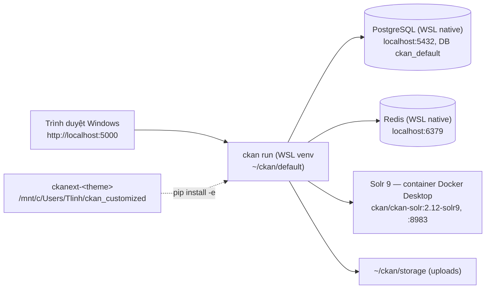

# Giai đoạn 1 — Cài CKAN 2.12 từ source trên WSL2 + phát triển theme

Mục tiêu: có một CKAN **2.12.0** chạy từ source trên máy local, vòng lặp sửa theme tính bằng giây.

## Kiến trúc local



## Layout thư mục

| Đường dẫn (WSL) | Nội dung |
|---|---|
| `~/ckan/default` | virtualenv (**đã tạo**) |
| `~/ckan/default/src/ckan` | source CKAN do `pip install -e git+...` clone về. Đọc template gốc ở `ckan/templates/` |
| `~/ckan/etc/ckan.ini` | file cấu hình |
| `~/ckan/storage` | `ckan.storage_path` (file upload) |
| `/mnt/c/Users/Tlinh/ckan_customized/ckanext-<theme>` | code theme (trong repo này) |

Docs gốc dùng `/usr/lib/ckan/default` và `/etc/ckan/default`. Dự án này cố ý đặt mọi thứ dưới `~` để khỏi cần sudo.

## Bước 1.1 — Gói hệ thống (USER tự chạy, cần sudo)

```bash
bash /mnt/c/Users/Tlinh/ckan_customized/setup_step1_system.sh
```

Script sẽ:
- cài `python3-dev libpq-dev python3-venv git redis-server libmagic1t64 postgresql` (tên gói theo Ubuntu 24.04);
- bật Postgres và Redis;
- tạo `~/ckan/etc` và `~/ckan/storage`;
- tạo role và DB `ckan_default` (hỏi mật khẩu DB, user tự đặt và tự nhớ). Chạy lại script thì role/DB đã có sẽ được bỏ qua.

Kiểm tra:

```bash
pg_isready
redis-cli ping    # PONG
```

## Bước 1.2 — Cài CKAN từ source

```bash
source ~/ckan/default/bin/activate
pip install --upgrade pip setuptools wheel
git clone --depth 1 --branch ckan-2.12.0 https://github.com/ckan/ckan.git ~/ckan/default/src/ckan
pip install -e "$HOME/ckan/default/src/ckan[requirements]"
pip install -r ~/ckan/default/src/ckan/dev-requirements.txt   # BẮT BUỘC ở local: debug=true cần flask-debugtoolbar, generate extension cần cookiecutter
```

- Docs gốc của CKAN dùng `pip install -e 'git+https://...@ckan-2.12.0#egg=ckan[requirements]'`. Pip ≥ 25 (máy này dùng 26.2.1) báo lỗi `invalid-egg-fragment` với lệnh đó, nên ở đây clone tay rồi cài từ đường dẫn local. Xem [gotchas](gotchas.md).
- `requirements` là extra khai báo trong `setup.py` của CKAN, trỏ tới `requirements.txt` với các phiên bản đã ghim. Trong đó chỉ `psycopg2` phải build từ source, cần `gcc`, `pg_config` và `python3-dev`.

- Kiểm tra bản patch mới hơn trước khi cài: `git ls-remote --tags https://github.com/ckan/ckan 'ckan-2.12.*'` (ngày 2026-09-11 mới có `ckan-2.12.0`). Có bản mới thì cập nhật tag ở mọi nơi: phase-1, Dockerfile và roadmap.
- Kiểm tra sau khi cài: `pip show ckan` (2.12 không có `ckan --version`) và `ckan -c ~/ckan/etc/ckan.ini db check` (lệnh mới ở 2.12, chạy sau bước 1.5).
- Python tối thiểu là 3.10. Máy này có 3.12.3.

## Bước 1.3 — Solr (Docker Desktop)

Bật trước: Docker Desktop → Settings → Resources → **WSL Integration** → bật cho Ubuntu.

```bash
docker run -d --name ckan-solr --restart unless-stopped \
  -p 8983:8983 -v ckan_solr_data:/var/solr ckan/ckan-solr:2.12-solr9
curl -s 'http://localhost:8983/solr/ckan/admin/ping?wt=json' | grep status   # "OK"
```

Core của image tên là `ckan`, nên `solr_url = http://localhost:8983/solr/ckan`.

## Bước 1.4 — Cấu hình

```bash
ckan generate config ~/ckan/etc/ckan.ini
```

Các key cần sửa:

```ini
sqlalchemy.url = postgresql://ckan_default:<DB_PASSWORD>@localhost/ckan_default
ckan.site_id = default
ckan.site_url = http://localhost:5000
solr_url = http://localhost:8983/solr/ckan
ckan.redis.url = redis://localhost:6379/0
ckan.storage_path = /home/tlinh/ckan/storage
debug = true                       # hiện footer debug tên template; CHỈ dùng local
ckan.locale_default = vi           # Q6 trong roadmap
ckan.locales_offered = vi en
```

`ckan.ini` chứa mật khẩu nên để ngoài repo (đã nằm ở `~/ckan/etc`) và đặt quyền `chmod 600`.

Ghi chú theo file thật mà 2.12.0 sinh ra (2026-09-14):
- Đã đúng sẵn, không cần sửa: `ckan.site_id`, `ckan.site_url`, `ckan.redis.url`, `solr_url = http://127.0.0.1:8983/solr/ckan`.
- Sửa key không bí mật bằng `ckan config-tool ~/ckan/etc/ckan.ini "key = value"`. Riêng `debug` phải thêm `-s DEFAULT` (xem gotchas).
- `ckan.plugins` để trống → đặt `activity text_view image_view`.
- `sqlalchemy.url` **user tự sửa** bằng `nano`, không dùng `config-tool` để mật khẩu khỏi nằm trong shell history. Chưa sửa thì mọi lệnh `ckan -c` đều lỗi kết nối DB.

## Bước 1.5 — Khởi tạo và chạy

```bash
ckan -c ~/ckan/etc/ckan.ini db init
ckan -c ~/ckan/etc/ckan.ini db upgrade -p activity      # db init KHÔNG migrate bảng của plugin
ckan -c ~/ckan/etc/ckan.ini db pending-migrations       # phải không còn gì
ckan -c ~/ckan/etc/ckan.ini sysadmin add admin email=admin@localhost name=admin   # hỏi mật khẩu
ckan -c ~/ckan/etc/ckan.ini run            # http://localhost:5000
```

- `ckan run` bật reloader mặc định (tắt bằng `-r` / `--disable-reloader`). Sửa Python, template hoặc config thì **không cần** restart. **Thêm file hoặc thư mục mới** (ví dụ template override mới) thì phải restart.
- Nếu Windows không mở được `localhost:5000`, chạy `ckan ... run -H 0.0.0.0` rồi dùng IP của WSL.

## Bước 1.6 — Smoke test

1. Đăng nhập admin, tạo **Organization**.
2. Tạo **Dataset** có 2 resource: một file CSV upload (kiểm tra storage) và một URL `jdbc:trino://10.1.117.91:30800/iceberg_curated/demo` (mô phỏng use case).
3. Tìm kiếm dataset ở `/dataset`. Thấy kết quả nghĩa là Solr hoạt động.
4. API: `curl http://localhost:5000/api/3/action/status_show` và `.../package_search?q=`.

## Bước 1.6b — Chọn theme gốc: classic hay Midnight Blue (Q9)

CKAN 2.12 có hai bộ template gốc. Làm bước này **trước** khi viết template:

```ini
# Midnight Blue (bỏ 2 dòng này để quay về classic)
ckan.base_templates_folder = templates-midnight-blue
ckan.base_public_folder = public-midnight-blue
```

1. Restart `ckan run` và xem trang chủ, `/dataset`, trang một dataset, `/organization`.
2. Tắt 2 dòng trên và xem lại để so sánh.
3. Chốt lựa chọn vào Decision log trong roadmap.

So sánh chi tiết ở [ckan-theming.md](ckan-theming.md#chọn-theme-gốc-classic-hay-midnight-blue-q9).

## Bước 1.7 — Scaffold extension theme

```bash
cd /mnt/c/Users/Tlinh/ckan_customized
ckan generate extension -o .      # hỏi tên: ckanext-<theme> (xem Q1 trong roadmap)
pip install -e ./ckanext-<theme>
```

- Thêm plugin vào `ckan.ini`: `ckan.plugins = <theme> activity ...`. Đặt theme **đầu** danh sách để template của nó được ưu tiên.
- Restart `ckan run`.
- Cách làm theme chi tiết: [ckan-theming.md](ckan-theming.md).

## Bước 1.8 (tùy chọn) — DataStore + xloader

Chỉ làm khi Q4 được chốt.
- Tạo DB `datastore_default` và role read-only `datastore_default`.
- Cấu hình `ckan.datastore.write_url` và `ckan.datastore.read_url`.
- Chạy `ckan -c ... datastore set-permissions | sudo -u postgres psql --set ON_ERROR_STOP=1` (**user tự chạy** vì cần sudo).
- Cài `ckanext-xloader` và chạy `ckan -c ... jobs worker`.

## Tiêu chí hoàn thành GĐ1
- [ ] Smoke test 1.6 qua hết.
- [ ] Theme plugin bật và các mục trong checklist theme đã xong.
- [ ] Mọi key `ckan.ini` khác mặc định đã ghi vào [bảng ánh xạ cấu hình](phase-2-docker-packaging.md#bảng-ánh-xạ-cấu-hình).
