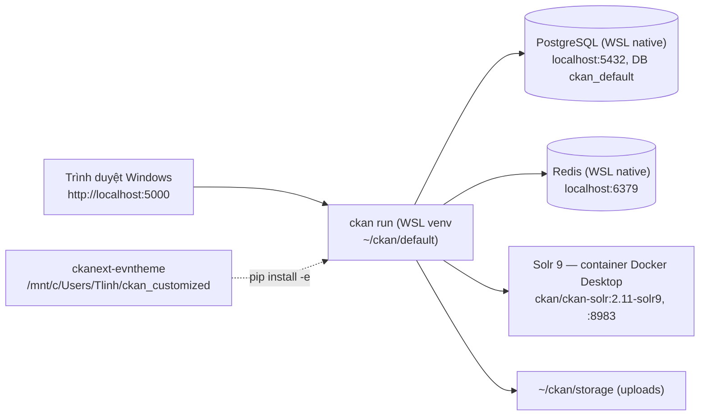

# Giai đoạn 1 — Cài CKAN 2.11 từ source trên WSL2 + phát triển theme

Mục tiêu: có một CKAN **2.11.6** chạy từ source trên máy local, vòng lặp sửa theme tính bằng giây.

> Ngày 2026-09-18 dự án quay từ 2.12.0 về 2.11.6 (Decision log trong [roadmap](roadmap.md)). Máy đã cài 2.12.0 thì chạy **bước 1.1b** thay cho các bước 1.2–1.5.

## Kiến trúc local



## Layout thư mục

| Đường dẫn (WSL) | Nội dung |
|---|---|
| `~/ckan/default` | virtualenv |
| `~/ckan/default/src/ckan` | source CKAN (clone tag `ckan-2.11.6`). Đọc template gốc ở `ckan/templates/` |
| `~/ckan/etc/ckan.ini` | file cấu hình |
| `~/ckan/storage` | `ckan.storage_path` (file upload) |
| `~/ckan/backup` | bản backup do script 1.1b tạo (`pg_dump`, `ckan.ini` cũ), quyền 700 |
| `/mnt/c/Users/Tlinh/ckan_customized/ckanext-evntheme` | code theme (trong repo này), từ 2026-09-19. Theme cũ `ckanext-lakehouse_theme` đã gỡ và xóa ngày 2026-09-20, vẫn còn trong lịch sử git |

Docs gốc dùng `/usr/lib/ckan/default` và `/etc/ckan/default`. Dự án này cố ý đặt mọi thứ dưới `~` để khỏi cần sudo.

## Bước 1.1 — Gói hệ thống (USER tự chạy, cần sudo)

```bash
bash /mnt/c/Users/Tlinh/ckan_customized/setup_step1_system.sh
```

Script sẽ:
- cài `python3-dev libpq-dev python3-venv git redis-server libmagic1t64 postgresql` (tên gói theo Ubuntu 24.04);
- bật Postgres và Redis;
- tạo `~/ckan/etc` và `~/ckan/storage`;
- tạo role và DB `ckan_default` (hỏi mật khẩu DB, user tự đặt và tự nhớ). Chạy lại script thì role/DB đã có sẽ được bỏ qua.

Gói hệ thống giống nhau cho 2.11 và 2.12, nên đã chạy rồi thì không phải chạy lại.

Kiểm tra:

```bash
pg_isready
redis-cli ping    # PONG
```

## Bước 1.1b — Chuyển bản cài 2.12.0 sang 2.11.6 (USER tự chạy, không cần sudo)

Mở Docker Desktop và dừng `ckan run` trước, rồi chạy:

```bash
bash /mnt/c/Users/Tlinh/ckan_customized/setup_step2_switch_to_2.11.sh
```

Script hỏi xác nhận **một lần** trước khi xóa gì, rồi làm lần lượt:
1. Xóa venv `~/ckan/default` và làm lại đúng như bước 1.2 với tag `ckan-2.11.6`, cộng `dev-requirements.txt` và `pip install -e` theme. Sau đó chạy `pip check` và `pybabel compile` bản dịch theme.
2. Nếu `ckan.ini` còn mật khẩu mẫu thì copy sang `~/ckan/backup` rồi sinh lại bằng 2.11. Sau đó đặt các key trong [bảng ánh xạ cấu hình](phase-2-docker-packaging.md#bảng-ánh-xạ-cấu-hình), rồi **mở `nano` để user tự điền mật khẩu DB** vào `sqlalchemy.url`.
3. Thay container Solr bằng `ckan/ckan-solr:2.11-solr9`, xóa cả volume `ckan_solr_data`. Bước này phải chạy **trước** mọi lệnh `ckan -c` (xem [gotchas](gotchas.md) 6o).
4. Nếu DB đang ở schema 2.12 (có bảng `file_owner`) thì `pg_dump` sang `~/ckan/backup`, rồi `ckan db clean`, `db init`, `db upgrade -p activity`, `search-index rebuild`.
5. Tạo sysadmin `admin`. User tự đặt mật khẩu khi được hỏi.

- Chạy lại nhiều lần được: bước nào đã xong thì script bỏ qua.
- Script cũng dùng được cho máy mới sau bước 1.1, thay cho 1.2–1.5.
- Không hạ schema bằng `ckan db downgrade`, vì việc đó cần code 2.12 và mật khẩu DB. Dữ liệu cũ chỉ là dữ liệu mẫu, sẽ dựng lại ở bước 1.6.

## Bước 1.2 — Cài CKAN từ source

```bash
source ~/ckan/default/bin/activate
pip install --upgrade pip setuptools wheel
git clone --depth 1 --branch ckan-2.11.6 https://github.com/ckan/ckan.git ~/ckan/default/src/ckan
pip install -e "$HOME/ckan/default/src/ckan[requirements]"
pip install -r ~/ckan/default/src/ckan/dev-requirements.txt   # BẮT BUỘC ở local: debug=true cần flask-debugtoolbar, generate extension cần cookiecutter
```

- Docs gốc của CKAN dùng `pip install -e 'git+https://...@ckan-2.11.6#egg=ckan[requirements]'`. Pip ≥ 25 báo lỗi `invalid-egg-fragment` với lệnh đó, nên ở đây clone tay rồi cài từ đường dẫn local. Xem [gotchas](gotchas.md).
- `requirements` là extra khai báo trong `setup.py` của CKAN, trỏ tới `requirements.txt` với các phiên bản đã ghim. Trong đó chỉ `psycopg2` phải build từ source, cần `gcc`, `pg_config` và `python3-dev`.
- Kiểm tra bản vá mới hơn trước khi cài: `git ls-remote --tags https://github.com/ckan/ckan 'ckan-2.11.*'`. Ngày 2026-09-18, bản mới nhất là `ckan-2.11.6` (phát hành 2026-08-26, cùng ngày với 2.12.0, gồm 8 bản vá bảo mật). Có bản mới thì cập nhật tag ở mọi nơi: phase-1, script 1.1b, Dockerfile và roadmap.
- Kiểm tra sau khi cài: `pip show ckan`. 2.11 **không có** `ckan db check`; thay bằng `ckan -c ~/ckan/etc/ckan.ini db version` và `db pending-migrations`, chạy sau bước 1.5.
- Python tối thiểu là 3.10: 2.11.5 bỏ 3.9 và thêm 3.13, 3.14. Máy này có 3.12.3.

## Bước 1.3 — Solr (Docker Desktop)

Bật trước: Docker Desktop → Settings → Resources → **WSL Integration** → bật cho Ubuntu.

```bash
docker run -d --name ckan-solr --restart unless-stopped \
  -p 8983:8983 -v ckan_solr_data:/var/solr ckan/ckan-solr:2.11-solr9
curl -s 'http://localhost:8983/solr/ckan/admin/ping?wt=json' | grep status   # "OK"
```

- Core của image tên là `ckan`, nên `solr_url = http://127.0.0.1:8983/solr/ckan`.
- CKAN 2.11 chỉ nhận schema Solr `2.8`–`2.11`. Container hoặc volume còn schema 2.12 thì phải thay (bước 1.1b đã làm).

## Bước 1.4 — Cấu hình

```bash
ckan generate config ~/ckan/etc/ckan.ini    # GHI ĐÈ không hỏi nếu file đã có (gotchas 6n)
```

Các key cần sửa, đầy đủ ở [bảng ánh xạ cấu hình](phase-2-docker-packaging.md#bảng-ánh-xạ-cấu-hình). Script 1.1b đặt sẵn tất cả trừ mật khẩu:

```ini
sqlalchemy.url = postgresql://ckan_default:<DB_PASSWORD>@localhost/ckan_default
ckan.site_url = http://localhost:5000
solr_url = http://127.0.0.1:8983/solr/ckan
ckan.redis.url = redis://localhost:6379/0
ckan.storage_path = /home/tlinh/ckan/storage
ckan.plugins = evntheme activity tracking text_view image_view   # + db upgrade -p tracking / -p evntheme
debug = true                       # trong [DEFAULT]; hiện footer debug tên template; CHỈ dùng local
ckan.locale_default = vi           # Q6 trong roadmap
ckan.locales_offered = vi en
```

`ckan.ini` chứa mật khẩu nên để ngoài repo (đã nằm ở `~/ckan/etc`) và đặt quyền `chmod 600`.

Ghi chú theo `config_declaration.yaml` của 2.11.6:
- `ckan generate config` đặt sẵn `ckan.plugins = activity`, `solr_url = http://127.0.0.1:8983/solr/ckan`, `ckan.redis.url = redis://localhost:6379/0`, còn `ckan.storage_path` thì chưa có.
- Sửa key không bí mật bằng `ckan config-tool ~/ckan/etc/ckan.ini "key = value"`. Riêng `debug` phải thêm `-s DEFAULT` (xem gotchas).
- `sqlalchemy.url` **user tự sửa** bằng `nano`, không dùng `config-tool` để mật khẩu khỏi nằm trong shell history. Chưa sửa thì mọi lệnh `ckan -c` đều lỗi kết nối DB.
- `ckan.base_templates_folder` / `ckan.base_public_folder` ở 2.11 **chỉ nhận** `templates` / `public`. Giá trị khác, ví dụ `templates-midnight-blue`, làm CKAN báo lỗi khi khởi động.

## Bước 1.5 — Khởi tạo và chạy

```bash
ckan -c ~/ckan/etc/ckan.ini db init
ckan -c ~/ckan/etc/ckan.ini db upgrade -p activity      # db init KHÔNG migrate bảng của plugin
ckan -c ~/ckan/etc/ckan.ini db pending-migrations       # không có dòng "… unapplied migrations" là sạch (lệnh luôn in "Upgrading DB: SUCCESS")
ckan -c ~/ckan/etc/ckan.ini sysadmin add admin email=admin@localhost name=admin   # hỏi mật khẩu
ckan -c ~/ckan/etc/ckan.ini run            # http://localhost:5000
```

- `ckan run` bật reloader mặc định (tắt bằng `-r` / `--disable-reloader`). Sửa Python, template hoặc config thì **không cần** restart. **Thêm file hoặc thư mục mới** (ví dụ template override mới) thì phải restart.
- Nếu Windows không mở được `localhost:5000`, chạy `ckan ... run -H 0.0.0.0` rồi dùng IP của WSL.

## Bước 1.6 — Smoke test

1. Đăng nhập admin, tạo **Organization**.
2. Tạo **Dataset** có 2 resource: một file CSV upload (kiểm tra storage) và một URL `jdbc:trino://10.1.117.91:30800/iceberg_curated/demo` (mô phỏng use case).
3. Tìm kiếm dataset ở `/dataset`. Thấy kết quả nghĩa là Solr hoạt động.
4. API: `curl http://localhost:5000/api/3/action/status_show` và `.../package_search?q=`.

Agent tự làm được các bước trên qua API mà không cần mật khẩu admin: `ckan -c ... user token add admin smoke` in ra một API token để dùng tạm; thu hồi bằng action `api_token_revoke` sau khi xong.

Ngày 2026-09-18 (trên 2.11.6), dữ liệu mẫu gồm org `lakehouse-demo`, dataset `demo-curated-orders` (CSV + JDBC) và `demo-outage-summary` (CSV).

## Bước 1.6b — Theme gốc (Q9): classic

CKAN 2.11 chỉ có **một** bộ template/asset gốc là classic (`templates` / `public`, Bootstrap **5.1.3**). Bootstrap 3 đã bị bỏ từ 2.11.0; trong `templates-bs3` chỉ còn sót một file. Midnight Blue là tính năng mới của 2.12.

Ở 2.12, Q9 đã chốt Midnight Blue (2026-09-14). Khi quay về 2.11 (2026-09-18), theme chuyển sang classic. Chi tiết ở [ckan-theming.md](ckan-theming.md#theme-gốc-classic-q9).

## Bước 1.7 — Scaffold extension theme

Đã làm ngày 2026-09-14. Code extension không phụ thuộc phiên bản CKAN nên giữ nguyên.

> **2026-09-19:** theme đang dùng là `ckanext-evntheme` (làm theo mockup của user), không còn là `lakehouse_theme`. Cài đặt, cấu hình, dữ liệu demo (`ckan evntheme seed-demo`) và test xem trong [README của extension](../ckanext-evntheme/README.md). Các lệnh dưới đây giữ lại làm lịch sử của bước scaffold.

```bash
cd /mnt/c/Users/Tlinh/ckan_customized
ckan generate extension -o .      # tên: ckanext-lakehouse_theme (Q1); "include code examples?" → n
pip install -e ./ckanext-lakehouse_theme
ckan config-tool ~/ckan/etc/ckan.ini "ckan.plugins = lakehouse_theme activity text_view image_view"
pybabel compile -d ckanext-lakehouse_theme/ckanext/lakehouse_theme/i18n -D ckanext-lakehouse_theme   # sau mỗi lần sửa .po
```

- `generate extension` không có `--no-input`, nhưng đọc câu trả lời từ stdin nên có thể pipe vào (`printf '%s\n' ckanext-lakehouse_theme … n | ckan generate extension -o .`).
- Đặt theme **đầu** `ckan.plugins` để template của nó được ưu tiên. Restart `ckan run`.
- Scaffold có sẵn lỗi: `tests/test_plugin.py` gọi `plugin_loaded` chưa import, `MANIFEST.in` trỏ `README.rst` trong khi file là `README.md`. Cả hai đã được sửa.
- **Xem thử như production** (tắt debug, asset được bundle/minify, không có toolbar) mà không phải sửa `ckan.ini`:
  1. Tạo `~/ckan/etc/ckan-shot.ini`, trong `[DEFAULT]` đặt `debug = false`.
  2. Trong `[app:main]` đặt `use = config:/home/tlinh/ckan/etc/ckan.ini`, `ckan.site_url = http://localhost:5002`, `ckan.webassets.path = …/webassets-prod`.
  3. Ở 2.11, chép thêm các section logging (`[loggers]` … `[formatter_generic]`) vào file này. Thiếu thì CLI crash `KeyError: 'formatters'` (gotchas 6s). File hiện có đã được bổ sung ngày 2026-09-18.
  4. Chạy `ckan -c ~/ckan/etc/ckan-shot.ini run -p 5002`.
- Unit test thuần: `python -m pytest -o addopts="" -p no:ckan -p no:ckan_fixtures ckanext/lakehouse_theme/tests/test_helpers.py` (xem gotchas 6k).
- Cách làm theme chi tiết: [ckan-theming.md](ckan-theming.md).

## Bước 1.8 — DataStore + XLoader (đã làm 2026-09-22)

Q4 chốt "có" (2026-09-19). Cả bước này được gói trong `setup_step3_datastore.sh` ở gốc repo, **user tự chạy** vì cần sudo. Script làm các việc sau:
- tạo DB `datastore_default` (owner `ckan_default`) và role chỉ đọc `datastore_default`;
- đặt `ckan.datastore.write_url` / `ckan.datastore.read_url` trong `ckan.ini`;
- `ckan datastore set-permissions | sudo -u postgres psql --set ON_ERROR_STOP=1`;
- cài **XLoader 2.5.0 editable từ source** vào `~/ckan/default/src/ckanext-xloader`. Bắt buộc cài editable: bản wheel không import được (gotchas 6ak);
- bật plugin `datastore xloader datatables_view` và tạo DB test.

Sau đó chạy worker trong một terminal riêng, rồi nạp các CSV có sẵn:

```bash
ckan -c ~/ckan/etc/ckan.ini jobs worker
ckan -c ~/ckan/etc/ckan.ini xloader submit all
```

Kết quả ngày 2026-09-22: 12/12 resource CSV vào DataStore; tab Xem trước và Thử API có dữ liệu thật. Script đã phải sửa 4 lỗi trong lúc chạy (gotchas 6aj–6am).

## Tiêu chí hoàn thành GĐ1

Đã đạt hết trên 2.12.0 (2026-09-14), rồi kiểm tra lại trên 2.11.6:
- [x] Bước 1.1b chạy xong: `pip show ckan` ra 2.11.6, `pip check` sạch, Solr `2.11-solr9` ping OK, `db version` ở head, không còn migration treo (2026-09-18).
- [x] Smoke test 1.6 qua hết trên 2.11.6: 22/22 (2026-09-18).
- [x] Theme trên classic 2.11 được kiểm tra bằng ảnh chụp: chế độ debug và prod-like, 1366px và 400px. Các mục trong checklist theme vẫn đạt (2026-09-18).
- [x] Mọi key `ckan.ini` khác mặc định đã ghi vào [bảng ánh xạ cấu hình](phase-2-docker-packaging.md#bảng-ánh-xạ-cấu-hình) (2026-09-14, rà lại cho 2.11 ngày 2026-09-18).
