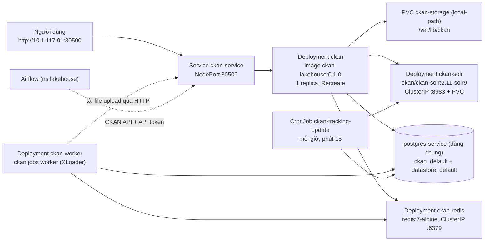

# Giai đoạn 3 — Triển khai lên cụm K8s on-prem (namespace `lakehouse`)

Mục tiêu: CKAN 2.11.6 + theme chạy ổn định tại **http://10.1.117.91:30500**, thay bản stub 2.10, không ảnh hưởng dịch vụ khác trên cluster dùng chung.

Bối cảnh cluster: [cluster-context.md](cluster-context.md). **Mọi lệnh ghi (apply/create/delete/exec psql) trên cluster công ty đều cần user xác nhận trước.**

> **Trạng thái 2026-09-25:**
> - Đã viết xong manifest `k8s/` (kustomize: base + overlay `lab` / `kind`) và 3 script.
> - **Đã tập dượt trọn quy trình trên cluster kind 1.30 dựng giống cluster công ty: smoke test đạt đủ 47 kiểm tra** ([mục 3.10](#310-tập-dượt-trên-kind--kết-quả-2026-09-25)).
> - Còn chờ hai việc bên ngoài: kubeconfig của cluster công ty (Q7), và chủ cluster đồng ý thay stub cùng tạo DB (Q8).

## Kiến trúc đích



Worker là **bắt buộc**, vì DataStore/XLoader đã bật (Q4). Worker **không** mount PVC: XLoader tải file upload qua HTTP từ `ckan-service`. Nhờ vậy worker chạy được trên bất kỳ node nào (đã kiểm chứng ở 3.10).

## 3.0 Điều kiện

- **Kubeconfig lưu ngoài repo**, ví dụ `~/.kube/lakehouse.conf` trong WSL. Gộp vào `~/.kube/config` hoặc dùng `KUBECONFIG=`.
  - Mọi script trong `k8s/scripts/` bắt buộc `--context`, vì `~/.kube/config` đã có sẵn các context kind (bẫy 21f).
  - Nếu kubeconfig là `admin.conf` (cluster-admin) thì càng phải cẩn thận. Nên xin infra một ServiceAccount/role giới hạn trong ns `lakehouse`.
- **kubectl** trong WSL là v1.36, cluster là v1.30 (bẫy 21h). Khi tập dượt trên 1.30.13 thì mọi lệnh cần dùng đều chạy đúng.
- **Image tarball** không giữ trong repo. Tạo lại bằng một lệnh, file 562.6 MB (537 MiB):

  ```bash
  docker save ckan-lakehouse:0.1.0 | gzip -1 > ~/ckan-lakehouse_0.1.0.tar.gz
  ```

## 3.1 Audit read-only

```bash
bash k8s/scripts/audit.sh --context <ctx> | tee ~/ckan-audit-$(date +%F).txt
```

Script chỉ dùng `get`, `auth can-i`, `logs` và `helm list`. Nó không in Secret hay giá trị env nào. Nó trả lời các câu hỏi sau:

| Câu hỏi | Vì sao cần |
|---|---|
| Kiến trúc CPU và phiên bản containerd của node | Image build cho amd64. containerd quyết định giới hạn fd (bẫy 21a) |
| CPU/RAM còn trống trên mỗi node | CKAN request ~0.65 CPU / ~1.7 GiB, limit 4.5 CPU / ~4.8 GiB |
| Label Pod Security của ns, StorageClass | Cần `local-path` |
| `auth can-i`: create deployments, services, secrets, configmaps, PVC, cronjobs, `pods/exec`; delete | Xác định việc nào mình tự làm, việc nào phải nhờ infra |
| ResourceQuota, LimitRange, NetworkPolicy | Mỗi thứ đều có thể chặn deploy |
| Stub `ckan`: image, selector, log | Bẫy 21b |
| Trùng tên/cổng: 30500, `ckan-*`, `solr`, `redis` | Bẫy 20, 21d |
| `postgres-service`: tên workload, image (cần ≥ 15), cổng | Bẫy 15e |
| Image đang chạy trên cluster lấy từ đâu | Node có kéo được từ Docker Hub không (Solr, Redis) |

Lưu output **ngoài repo** vì nó liệt kê workload của đồng nghiệp. Chép kết luận vào [cluster-context.md](cluster-context.md).

## 3.2 Quyết định cần chốt với user / chủ cluster

1. **Bản stub `ckan`** (Q8): xóa `deploy/ckan` và `svc/ckan-service` cũ, rồi apply bản mới cùng tên để giữ cổng 30500.
   - Bắt buộc phải xóa: selector của Deployment không sửa được (bẫy 21b).
   - Chỉ làm khi đã xác nhận không ai dùng stub.
2. **Phân phối image:**
   - Nếu infra có registry: push lên đó và dùng `imagePullSecrets` nếu cần.
   - Nếu không: import tarball lên **cả 2 worker** (3.4).
3. **File upload:** PVC `local-path` (mặc định, đã tập dượt) hay MinIO (`minio-service:9000`).
   - 2.11 không có tầng file `ckan.files.*`, nên MinIO phải qua một extension upload S3 kiểu `IUploader` (Q10).
   - Khi dùng MinIO: pod `ckan` không còn bị ghim vào node và có thể tăng replica.
4. **Tài nguyên:** số trong manifest dựa trên đo đạc ở 3.10. Đối chiếu với phần "Free capacity" của audit.
5. **DB:** agent chạy `prepare-postgres.sh --apply`, hoặc đưa file SQL (`--print`) để chủ Postgres tự chạy (3.3).

## 3.3 Chuẩn bị DB trên `postgres-service` dùng chung

```bash
bash k8s/scripts/make-secrets.sh lab                                  # sinh k8s/overlays/lab/secrets.env (không commit)
bash k8s/scripts/prepare-postgres.sh --context <ctx> lab              # chỉ đọc: version, role/DB đã có chưa
bash k8s/scripts/prepare-postgres.sh --context <ctx> lab --apply      # sau khi được đồng ý
bash k8s/scripts/prepare-postgres.sh --print lab > ~/ckan-db.sql      # hoặc: đưa file này cho chủ Postgres
```

Nếu audit cho thấy `postgres-service` không nghe ở `:5432`, sinh lại secrets với `PG_HOST=postgres-service:<port>`.

`prepare-postgres.sh` tạo **2 role + 2 DB**:
- role `ckan_default` (login, sở hữu cả hai DB);
- role `datastore_default` (login, về sau chỉ được đọc);
- DB `ckan_default` và `datastore_default`, UTF8.

Vì server dùng chung, script có ba giới hạn cố ý:
- **Chỉ `CREATE` thứ còn thiếu.** Role hay DB đã có thì được báo lại và để nguyên: không `ALTER`, không `DROP`.
- **Mật khẩu không đi dưới dạng rõ.** Script tự tính **SCRAM-SHA-256 verifier** ở máy local và gửi qua **stdin**. Vì vậy mật khẩu không nằm trong dòng lệnh `kubectl`, không vào audit log của API server, không vào log Postgres (bẫy 21g). File `--print` cũng chỉ chứa verifier.
- **Không cần mật khẩu superuser.** Script chạy `psql` bằng user của chính container Postgres qua socket local. Đổi lại, nó cần quyền `pods/exec`.

Quyền chỉ đọc cho `datastore_default` do `prerun.py` cấp khi pod `ckan` khởi động lần đầu (`datastore set-permissions`). Việc này chạy được mà không cần superuser nhờ `ckan_default` sở hữu DB, với Postgres ≥ 15 (bẫy 15e).

## 3.4 Đưa image lên node (khi chưa có registry)

```bash
# từ máy có SSH tới worker; lặp cho 10.1.117.88 và 10.1.117.235
scp ~/ckan-lakehouse_0.1.0.tar.gz <user>@10.1.117.88:/tmp/
ssh <user>@10.1.117.88 'gunzip -c /tmp/ckan-lakehouse_0.1.0.tar.gz | sudo ctr -n k8s.io images import - && sudo crictl images | grep ckan-lakehouse'
```

- Bước `sudo` trên worker do user tự chạy.
- Namespace containerd phải là `k8s.io` thì kubelet mới thấy image.
- Image được lưu với tên `docker.io/library/ckan-lakehouse:0.1.0`. Đó chính là tên kubelet chuẩn hóa từ `ckan-lakehouse:0.1.0` trong manifest.
- **Đã tập dượt:** Docker Desktop dùng containerd image store, nên `docker save` xuất ra OCI index. `ctr import` trên node kind (containerd 2.1) nhận bình thường, mất khoảng 100 giây mỗi node.
- Manifest đặt `imagePullPolicy: IfNotPresent` và tag cụ thể (`images.newTag` trong `k8s/base/kustomization.yaml`).

## 3.5 Manifest — [k8s/](../k8s)

```
k8s/
├── base/                        # chung cho mọi cluster — đây là thứ lên cluster công ty
│   ├── kustomization.yaml       # namespace lakehouse, label part-of=ckan, images.newTag
│   ├── config.env               # → ConfigMap ckan-config (hash suffix)
│   ├── solr.yaml                # PVC ckan-solr-data 5Gi + Deployment + Service ClusterIP
│   ├── redis.yaml               # Deployment (emptyDir) + Service ClusterIP
│   ├── ckan.yaml                # PVC ckan-storage 10Gi + Deployment + Service NodePort 30500
│   ├── ckan-worker.yaml         # Deployment `ckan jobs worker`, initContainer chờ ckan-service
│   └── ckan-tracking.yaml       # CronJob `ckan tracking update` (15 * * * *)
├── overlays/
│   ├── lab/                     # cluster công ty: site_url, OpenMetadata URL, secrets.env
│   └── kind/                    # tập dượt: + Namespace, StorageClass local-path, postgres-service giả,
│                                #   kind-cluster.yaml, smoke-test.sh
├── secrets.env.example          # tên key của Secret, không có giá trị thật
└── scripts/
    ├── audit.sh                 # 3.1, read-only
    ├── make-secrets.sh          # sinh overlays/<env>/secrets.env
    └── prepare-postgres.sh      # 3.3
```

**Base không có object `Namespace`.** Namespace `lakehouse` là của cả nhóm; nếu base khai báo nó thì một lệnh `kubectl delete -k` sẽ xóa luôn cả namespace.

**Key trong Secret `ckan-secrets`** (tất cả do `make-secrets.sh` sinh):

| Key | Ghi chú |
|---|---|
| `CKAN_SQLALCHEMY_URL` | DB chính |
| `CKAN_DATASTORE_WRITE_URL` | Ghi DataStore |
| `CKAN_DATASTORE_READ_URL` | Đọc DataStore |
| `CKANEXT__XLOADER__JOBS_DB__URI` | Nhật ký job XLoader |
| `CKAN_SYSADMIN_PASSWORD` | |
| `CKAN___SECRET_KEY`, `CKAN___WTF_CSRF_SECRET_KEY` | |
| `CKAN___API_TOKEN__JWT__ENCODE__SECRET`, `CKAN___API_TOKEN__JWT__DECODE__SECRET` | Cùng một giá trị |

Ba trong bốn URL trên dùng chung mật khẩu của `ckan_default`.

### Điểm then chốt, đều đã kiểm chứng ở 3.10

- **ckan:**
  - `replicas: 1`, `strategy: Recreate`, `fsGroup: 502` (gid chính của user `ckan`).
  - startupProbe 5 phút cho `prerun.py`; readiness và liveness gọi `/api/action/status_show`.
  - Resources: request 250m/512Mi, limit 2/2Gi.
  - **`EXTRA_UWSGI_OPTS=--max-fd 65536`** để tránh OOMKilled do containerd cấp giới hạn fd quá lớn (bẫy 21a).
- **ckan-worker:**
  - Cùng image. `command` là `worker-entrypoint.sh`, script này ghi lại `ckan.plugins` rồi `exec ckan jobs worker`.
  - initContainer chờ `ckan-service` trả 200, tương đương `depends_on: service_healthy` của compose.
  - Không có volume.
- **ckan-tracking-update:**
  - CronJob `concurrencyPolicy: Forbid`. Chạy `config-tool` rồi `ckan tracking update`.
  - Lệnh này cần cả Postgres lẫn Solr, vì nó reindex các dataset có lượt xem mới.
- **ckan-solr:**
  - uid/fsGroup 8983, `SOLR_HEAP=512m`, limit 1.5Gi. Core `ckan` được `solr-precreate` tạo trên PVC rỗng.
  - Liveness chỉ kiểm tra cổng (JVM). Core hỏng thì restart cũng không chữa được.
- **Mọi pod:**
  - `enableServiceLinks: false`, vì Service của người khác trong ns dùng chung có thể bơm biến lạ vào pod (bẫy 21d).
  - `automountServiceAccountToken: false`, vì CKAN không gọi API K8s.
- **ConfigMap/Secret sinh bằng generator có hash suffix:** đổi một giá trị là pod tự rollout. Overlay khai báo lại `namespace:` (bẫy 21c).

## 3.6 Triển khai & kiểm tra trên cluster công ty

Làm tuần tự. Mỗi bước ghi đều chờ user xác nhận.

```bash
CTX=<context của cluster công ty>
bash k8s/scripts/audit.sh --context $CTX | tee ~/ckan-audit-$(date +%F).txt   # 1. audit (3.1)
#                                                                             # 2. chốt 3.2 với chủ cluster; xóa stub nếu được phép
bash k8s/scripts/make-secrets.sh lab                                          # 3. secrets + DB (3.3)
bash k8s/scripts/prepare-postgres.sh --context $CTX lab --apply
#                                                                             # 4. image lên 2 worker (3.4)
kubectl --context $CTX apply -k k8s/overlays/lab --dry-run=server             # 5. dry-run, đọc kỹ output
kubectl --context $CTX apply -k k8s/overlays/lab                              # 6. apply
kubectl --context $CTX -n lakehouse rollout status deploy/ckan-solr deploy/ckan-redis deploy/ckan deploy/ckan-worker
curl http://10.1.117.91:30500/api/3/action/status_show                        # 7. kiểm tra
```

Kiểm tra ở bước 7, chỉ những thao tác được phép trên môi trường thật:
- `status_show` báo 2.11.6 và đủ plugin;
- 7 trang cùng 4 tab trả 200 và có `class="evn-header"`;
- đăng nhập `admin` (mật khẩu trong `k8s/overlays/lab/secrets.env`), sau đó đổi email admin;
- một dataset thử với file CSV upload, rồi xác nhận tab Xem trước có dữ liệu (XLoader);
- `kubectl create job --from=cronjob/ckan-tracking-update tracking-manual`.

**Không** chạy `seed-demo` trên cluster công ty: đó là dữ liệu giả.

Xong thì cập nhật [cluster-context.md](cluster-context.md) và bỏ ghi chú "stub".

## 3.7 Nâng cấp / rollback

1. Tăng version: build `ckan-lakehouse:0.1.1`, `docker save`, rồi import lên 2 worker.
2. Sửa `images.newTag` trong `k8s/base/kustomization.yaml`, sau đó `apply -k … --dry-run=server` rồi mới `apply -k`.
3. Nếu lỗi: `kubectl -n lakehouse rollout undo deploy/ckan deploy/ckan-worker`, rồi trả tag trong git về như cũ.
4. **Mỗi lần deploy portal gián đoạn khoảng 30 giây** (`Recreate` + `prerun.py`, bẫy 21e). Nên deploy ngoài giờ.
5. ConfigMap/Secret có hash để lại bản cũ sau mỗi lần đổi. Thỉnh thoảng dọn: xem bằng `kubectl -n lakehouse get cm,secret -l app.kubernetes.io/part-of=ckan`, rồi xóa những bản không còn pod nào dùng.
6. ⚠ **`kubectl delete -k k8s/overlays/lab` xóa cả PVC `ckan-storage` và `ckan-solr-data`**. Reclaim policy của `local-path` là `Delete`, nên toàn bộ file upload mất theo. Chỉ xóa từng object cụ thể.
7. Nâng bản vá CKAN core (vd. 2.11.7): đổi base tag `ckan-base`, và tag Solr nếu có bản mới, rồi rebuild.
   - `prerun.py` tự chạy `db init`/upgrade. **Backup DB trước.**
   - Sau khi deploy, chạy `ckan -c /srv/app/ckan.ini db pending-migrations` (2.11 không có `db check`).
   - Lên nhánh 2.12 là một dự án riêng (gotchas 6q, 24, 25).

## 3.8 Vận hành

- **Backup:**
  - `pg_dump` hai DB `ckan_default` và `datastore_default`.
  - Nội dung PVC `ckan-storage`: `kubectl exec deploy/ckan -- tar czf - -C /var/lib/ckan . > ckan-storage-$(date +%F).tgz`.
  - Solr **không cần** backup: `ckan -c /srv/app/ckan.ini search-index rebuild`.
- **Node chết:** PV `local-path` bị ghim vào node, nên pod `ckan` (và `ckan-solr`) Pending cho tới khi node sống lại. Đây là giới hạn đã chấp nhận. Worker và CronJob không bị ảnh hưởng.
- **Job XLoader:**
  - Log: `kubectl logs deploy/ckan-worker`.
  - Redis không persist; job còn trong hàng đợi thì mất khi pod Redis restart. Gửi lại bằng `ckan xloader submit all`.
- **Tracking:** CronJob chạy mỗi giờ vào phút 15. `failedJobsHistoryLimit: 3` giữ lại pod lỗi để xem log.

## 3.9 Tích hợp Lakehouse (sau go-live)

- **Airflow → CKAN:**
  - Tạo user bot và **API token** trên CKAN, lưu vào Airflow Connection (không hard-code).
  - Task gọi `package_create`/`package_patch` và `resource_create` (upload CSV từ `curated_outage_summary`).
  - Gọi qua service nội bộ: `http://ckan-service.lakehouse:5000`.
- **Trino:** resource dạng URL `jdbc:trino://10.1.117.91:30800/iceberg_curated/demo`. Theme đã có hộp hướng dẫn kết nối.
- **OpenMetadata:** đồng bộ metadata hai chiều qua API của cả hai (script/DAG riêng); thiết kế sau.

## 3.10 Tập dượt trên kind — kết quả 2026-09-25

Cluster `ckan-rehearsal` ([kind-cluster.yaml](../k8s/overlays/kind/kind-cluster.yaml)) có dáng giống cluster công ty:
- 1 control-plane (NoSchedule) + 2 worker;
- K8s **v1.30.13** (công ty chạy 1.30.14), containerd;
- rancher local-path provisioner;
- NodePort 30500 map ra `localhost:30500`.

Overlay `kind` chỉ thêm những thứ cluster công ty đã có sẵn: namespace, StorageClass tên `local-path`, và một `postgres-service` **chỉ có superuser**. DB của CKAN được tạo bằng đúng `prepare-postgres.sh` như trên cluster thật.

Tái hiện:

```bash
kind create cluster --config k8s/overlays/kind/kind-cluster.yaml && kubectl config use-context <context cũ>
docker save ckan-lakehouse:0.1.0 | gzip -1 > /tmp/ckan.tar.gz
for n in ckan-rehearsal-worker ckan-rehearsal-worker2; do gunzip -c /tmp/ckan.tar.gz | docker exec -i $n ctr -n k8s.io images import -; done
bash k8s/scripts/make-secrets.sh kind
kubectl --context kind-ckan-rehearsal apply -f k8s/overlays/kind/namespace.yaml
kubectl --context kind-ckan-rehearsal apply -k k8s/overlays/kind --dry-run=server
kubectl --context kind-ckan-rehearsal apply -k k8s/overlays/kind
bash k8s/scripts/prepare-postgres.sh --context kind-ckan-rehearsal kind --apply
bash k8s/overlays/kind/smoke-test.sh                     # 47 kiểm tra trên cluster mới, ~5 phút
kind delete cluster --name ckan-rehearsal                # dọn
```

| # | Nhóm kiểm tra | Kết quả |
|---|---|---|
| 1 | `status_show` 2.11.6, 7 plugin | 8/8 |
| 2 | `seed-demo`: 12 dataset, 9 tổ chức, 5 miền | 4/4 |
| 3 | 7 trang + 3 tab có marker theme, tiêu đề tiếng Việt, không gọi Google Fonts, favicon + `.woff2` tự host | 14/14 |
| 4 | Tìm kiếm tiếng Việt (`q=thuộc`) | 1/1 |
| 5 | API token; worker bị dời sang node **khác** node giữ `ckan-storage` | 2/2 |
| 6 | Upload CSV → tải về giống hệt → XLoader nạp vào DataStore (worker không có volume) → 11 resource `datastore_active` → tab Xem trước | 5/5 |
| 7 | Đăng nhập, cookie phiên | 1/1 |
| 8 | Role `datastore_default`: SELECT được, CREATE TABLE bị từ chối | 2/2 |
| 9 | Job từ CronJob tracking chạy xong, `tracking_summary` có số liệu | 2/2 |
| 10 | `rollout restart` pod web: pod mới **cùng node** (PV bị ghim); API token, cookie phiên, file upload, dataset, DataStore vẫn còn | 7/7 |
| 11 | Upload mới sau restart vẫn được XLoader nạp (token của XLoader được tạo lại) | 1/1 |

Hai lần chạy:
1. **Lần đầu, trên cluster mới: 45/47.** Hai kiểm tra đăng nhập trượt vì lỗi của chính smoke test: `--data-urlencode password@file` gửi kèm ký tự xuống dòng cuối file. Sửa script rồi chạy lại riêng hai bước đó thì qua cả hai, gồm cả việc cookie còn dùng được sau restart.
2. **Lần hai, bằng [smoke-test.sh](../k8s/overlays/kind/smoke-test.sh) đã commit: 46/46.** Bước `seed-demo` tự bỏ qua vì dữ liệu đã có.

**Phát hiện và sửa trong lúc tập dượt:**
- **Pod `ckan` OOMKilled** vì giới hạn fd 1073741816 của containerd (bẫy 21a). Sửa bằng `EXTRA_UWSGI_OPTS` trong ConfigMap, không cần build lại image. Đây chính là loại lỗi mà compose không thể lộ ra.
- `prepare-postgres.sh` chạy đúng cả ba chế độ (check, apply, chạy lại). `kubectl exec svc/postgres-service` dùng được, không cần biết tên pod.
- Sau `rollout status`, NodePort còn từ chối kết nối vài giây (bẫy 21e). Smoke test đã thêm bước retry.

**RAM đo bằng cgroup** (`memory.current` / `memory.peak`), dùng làm căn cứ cho requests/limits:

| Pod | Đang dùng | Đỉnh | Request / limit trong manifest |
|---|---|---|---|
| ckan | 173 MiB | 174 MiB | 512Mi / 2Gi |
| ckan-worker | 85 MiB | 124 MiB | 384Mi / 1Gi (CSV lớn sẽ tốn hơn) |
| ckan-solr | 721 MiB | 728 MiB | 768Mi / 1536Mi |
| ckan-redis | 4 MiB | 6 MiB | 64Mi / 256Mi |

## Tiêu chí hoàn thành GĐ3

- [x] Tập dượt trọn quy trình trên cluster kind 1.30 giống cluster công ty; smoke test đạt đủ 47 kiểm tra (2026-09-25).
- [ ] Portal chạy tại http://10.1.117.91:30500, theme đúng, smoke test qua hết.
- [ ] Restart pod không mất dữ liệu, session hay API token.
- [ ] Không có tài nguyên nào của team khác bị thay đổi.
- [ ] Tài liệu vận hành (backup, upgrade) đã cập nhật.
