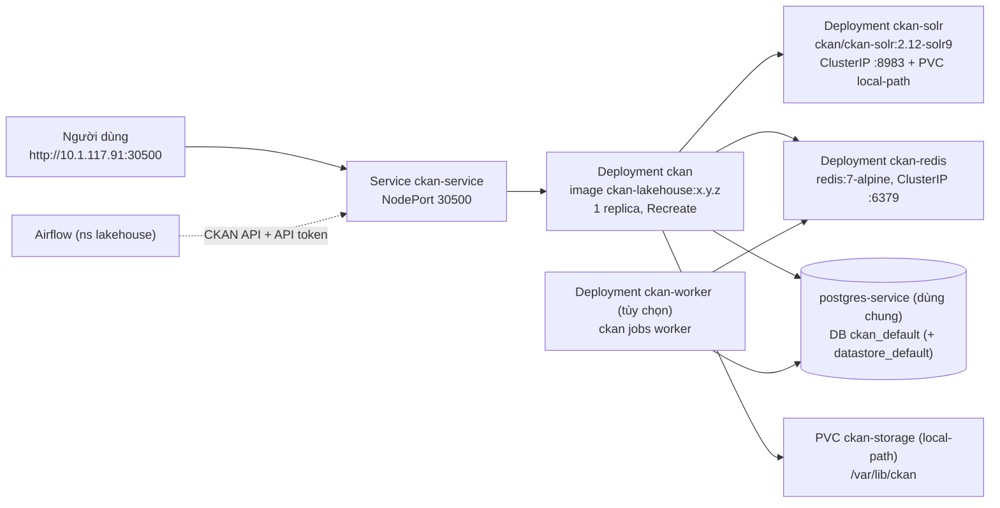

# Giai đoạn 3 — Triển khai lên cụm K8s on-prem (namespace `lakehouse`)

Mục tiêu: CKAN 2.12.0 + theme chạy ổn định tại **http://10.1.117.91:30500**, thay bản stub 2.10, không ảnh hưởng dịch vụ khác trên cluster dùng chung.

Bối cảnh cluster: [cluster-context.md](cluster-context.md). **Mọi lệnh ghi (apply/create/delete/exec psql) đều cần user xác nhận trước.**

## Kiến trúc đích



## 3.0 Điều kiện
- Kubeconfig lưu **ngoài repo**, ví dụ `~/.kube/lakehouse.conf` trong WSL. Dùng qua `KUBECONFIG=` hoặc `--kubeconfig`.
- Nếu đó là `admin.conf` (cluster-admin) thì càng phải cẩn thận. Đề xuất xin infra một ServiceAccount/role giới hạn trong ns `lakehouse`.
- Image tarball `ckan-lakehouse_<ver>.tar.gz` từ GĐ2.

## 3.1 Audit read-only

Theo mục 2.7 báo cáo. Ghi kết quả vào [cluster-context.md](cluster-context.md).

```bash
kubectl get nodes -o wide                         # kiến trúc CPU, IP, version
kubectl get ns; kubectl get storageclass
helm list --all-namespaces; kubectl get crd
kubectl auth can-i create deployments -n lakehouse
kubectl auth can-i create secrets -n lakehouse
kubectl auth can-i create persistentvolumeclaims -n lakehouse
kubectl -n lakehouse get deploy,sts,svc,pvc,cm -o wide
kubectl -n lakehouse get all,pvc | grep -i ckan   # bản stub hiện tại
kubectl -n lakehouse describe deploy ckan; kubectl -n lakehouse logs deploy/ckan --tail=100
kubectl get svc -A | grep -E '30500|8983|6379'    # xung đột NodePort/tên
kubectl describe nodes | grep -A8 'Allocated resources'   # còn bao nhiêu CPU/RAM
kubectl -n lakehouse get deploy,svc | grep -i postgres    # tên Deployment Postgres thật
```

## 3.2 Quyết định cần chốt với user / chủ cluster

1. **Bản stub `ckan`:** xóa `deploy/ckan` và `svc/ckan-service` cũ rồi apply bản mới cùng tên (giữ cổng 30500). Chỉ làm khi đã xác nhận không ai dùng.
2. **Phân phối image:**
   - Nếu infra có registry: push lên đó và dùng `imagePullSecrets` nếu cần.
   - Nếu không: import tarball lên **cả 2 worker** (xem 3.4).
3. **File upload:** PVC `local-path` (mặc định, đơn giản) hay MinIO (`minio-service:9000`).
   - MinIO dùng `ckanext-file-keeper-cloud` (adapter `ckan:s3`, chỉ hỗ trợ 2.12). Mẫu cấu hình ở [ckan-overview.md](ckan-overview.md#extension-hữu-ích).
   - Khi dùng MinIO: CKAN không cần PVC `ckan-storage`, pod không bị ghim vào node, và có thể tăng replica sau này.
   - Cần tạo bucket và access key riêng cho CKAN trên MinIO; key đưa vào Secret.
4. **Tài nguyên:** requests/limits phù hợp với số liệu audit.

## 3.3 Chuẩn bị DB trên `postgres-service` dùng chung

Cần xác nhận. Tên Deployment lấy từ audit.

```bash
kubectl -n lakehouse exec -it deploy/<postgres-deploy> -- psql -U postgres
```

```sql
CREATE ROLE ckan_default LOGIN PASSWORD '<từ Secret, không ghi vào docs>';
CREATE DATABASE ckan_default OWNER ckan_default ENCODING 'UTF8';
-- Chỉ khi bật DataStore (Q4):
CREATE ROLE datastore_default LOGIN PASSWORD '<...>';
CREATE DATABASE datastore_default OWNER ckan_default ENCODING 'UTF8';
```

Nếu dùng DataStore: sau khi pod CKAN chạy, `prerun.py` sẽ tự set quyền datastore (khi có `CKAN_DATASTORE_WRITE_URL` và `CKAN_DATASTORE_READ_URL`). Nếu không, chạy `ckan datastore set-permissions` rồi pipe vào psql.

## 3.4 Đưa image lên node (khi chưa có registry)

```bash
# từ máy có SSH tới worker; lặp cho 10.1.117.88 và 10.1.117.235
scp ckan-lakehouse_0.1.0.tar.gz <user>@10.1.117.88:/tmp/
ssh <user>@10.1.117.88 'gunzip -c /tmp/ckan-lakehouse_0.1.0.tar.gz | sudo ctr -n k8s.io images import -'
ssh <user>@10.1.117.88 'sudo crictl images | grep ckan-lakehouse'
```

- Namespace containerd phải là `k8s.io` thì kubelet mới thấy image.
- Trong manifest: `imagePullPolicy: IfNotPresent` và **tag cụ thể**.
- Image được build trên x86_64. Kiểm tra node cũng là amd64 (`kubectl get nodes -o wide` / `uname -m`).

## 3.5 Manifest

Raw YAML + kustomize, đúng phong cách của cluster.

```
k8s/
├── kustomization.yaml     # namespace: lakehouse, commonLabels app.kubernetes.io/part-of: ckan
├── ckan-configmap.yaml    # CKAN_SITE_URL, CKAN_SOLR_URL, CKAN_REDIS_URL, CKAN__PLUGINS, locale...
├── secrets.env.example    # tên key, không có giá trị thật; secrets.env thật KHÔNG commit
├── solr.yaml              # PVC ckan-solr-data + Deployment ckan-solr + Service ClusterIP
├── redis.yaml             # Deployment ckan-redis + Service ClusterIP
├── ckan.yaml              # PVC ckan-storage + Deployment ckan + Service ckan-service (NodePort 30500)
└── ckan-worker.yaml       # (tùy chọn) background jobs / xloader
```

Tạo Secret từ file không commit:

```bash
kubectl -n lakehouse create secret generic ckan-secrets --from-env-file=k8s/secrets.env \
  --dry-run=client -o yaml | kubectl apply -f -
```

Key trong Secret: `CKAN_SQLALCHEMY_URL`, `CKAN_DATASTORE_WRITE_URL`, `CKAN_DATASTORE_READ_URL`, `CKAN_SYSADMIN_PASSWORD`, `CKAN___SECRET_KEY`, `CKAN___WTF_CSRF_SECRET_KEY`, `CKAN___API_TOKEN__JWT__ENCODE__SECRET`, `CKAN___API_TOKEN__JWT__DECODE__SECRET`.

### Điểm then chốt từng manifest
- **ckan:**
  - `replicas: 1` và `strategy: Recreate`, vì PVC RWO và pod mới không được chạy song song với pod cũ.
  - `envFrom` configMap + secret; volume `ckan-storage` → `/var/lib/ckan`.
  - `securityContext.fsGroup: 502` (group `ckan-sys`) để user `ckan` ghi được vào PVC.
  - Probes `httpGet /api/action/status_show :5000`. Cần **startupProbe dài** (vd. `failureThreshold: 30`, `periodSeconds: 10`) vì `prerun.py` chạy `db init` mỗi lần start.
  - Resources gợi ý: requests `500m/1Gi`, limits `2/2Gi`.
  - Service `ckan-service` kiểu NodePort, `port 5000`, `nodePort: 30500`.
- **ckan-solr:**
  - PVC `local-path` (vd. 5Gi) → `/var/solr`; `strategy: Recreate`.
  - Solr chạy uid 8983; nếu bị lỗi quyền thì thêm `fsGroup: 8983`.
  - readinessProbe `GET /solr/ckan/admin/ping`. Service **ClusterIP** (không expose ra ngoài).
- **ckan-redis:** `redis:7-alpine`, không cần persist (queue/cache), Service ClusterIP.
- **ckan-worker (nếu có):** cùng image, `command: ["ckan","-c","/srv/app/ckan.ini","jobs","worker"]`, cùng configMap/secret. Lưu ý: không mount được cùng PVC RWO nếu pod nằm khác node.
- **Tên có tiền tố `ckan-`** và label `app.kubernetes.io/part-of: ckan` để tách biệt với tài nguyên khác trong ns dùng chung.

## 3.6 Triển khai & kiểm tra

```bash
kubectl apply -k k8s/ --dry-run=server        # kiểm tra trước, không ghi
kubectl apply -k k8s/                         # sau khi user xác nhận
kubectl -n lakehouse rollout status deploy/ckan-solr deploy/ckan-redis deploy/ckan
kubectl -n lakehouse logs deploy/ckan -f
curl http://10.1.117.91:30500/api/3/action/status_show
```

Chạy lại smoke test của GĐ1 trên URL cluster. Cập nhật cluster-context.md: bỏ ghi chú "stub".

## 3.7 Nâng cấp / rollback

1. Tăng version theme → build `ckan-lakehouse:0.1.1` → save → import lên 2 worker.
2. `kubectl -n lakehouse set image deploy/ckan ckan=ckan-lakehouse:0.1.1` (hoặc sửa YAML rồi apply).
3. Nếu lỗi: `kubectl -n lakehouse rollout undo deploy/ckan`.
4. Nâng CKAN core (vd. 2.12.1): đổi base tag `ckan-base` và tag Solr nếu có bản mới, rồi rebuild.
   - `prerun.py` tự chạy `db init`/upgrade. **Backup DB trước.**
   - Đọc migration notes trong changelog; với DataStore có thể phải chạy lại SQL `set-permissions`.
   - Sau khi deploy chạy `ckan db check` để kiểm tra.

## 3.8 Vận hành
- **Backup:** `pg_dump ckan_default` (và `datastore_default`), cộng nội dung PVC `ckan-storage`. Solr **không cần** backup vì dựng lại được bằng `ckan -c /srv/app/ckan.ini search-index rebuild`.
- **Node chết:** PV `local-path` bị ghim vào node, nên pod sẽ Pending cho tới khi node sống lại. Đây là giới hạn đã chấp nhận (Decision log).

## 3.9 Tích hợp Lakehouse (sau go-live)
- **Airflow → CKAN:**
  - Tạo user bot + **API token** trên CKAN, lưu vào Airflow Connection (không hard-code).
  - Task gọi `package_create`/`package_patch` và `resource_create` (upload CSV từ `curated_outage_summary`).
  - Gọi qua service nội bộ: `http://ckan-service.lakehouse:5000`.
- **Trino:** resource dạng URL `jdbc:trino://10.1.117.91:30800/iceberg_curated/demo`. Có thể thêm snippet theme hiển thị hướng dẫn kết nối.
- **OpenMetadata:** đồng bộ metadata hai chiều qua API của cả hai (script/DAG riêng); thiết kế sau.

## Tiêu chí hoàn thành GĐ3
- [ ] Portal chạy tại http://10.1.117.91:30500, theme đúng, smoke test qua hết.
- [ ] Restart pod không mất dữ liệu, session hay API token.
- [ ] Không có tài nguyên nào của team khác bị thay đổi.
- [ ] Tài liệu vận hành (backup, upgrade) đã cập nhật.
