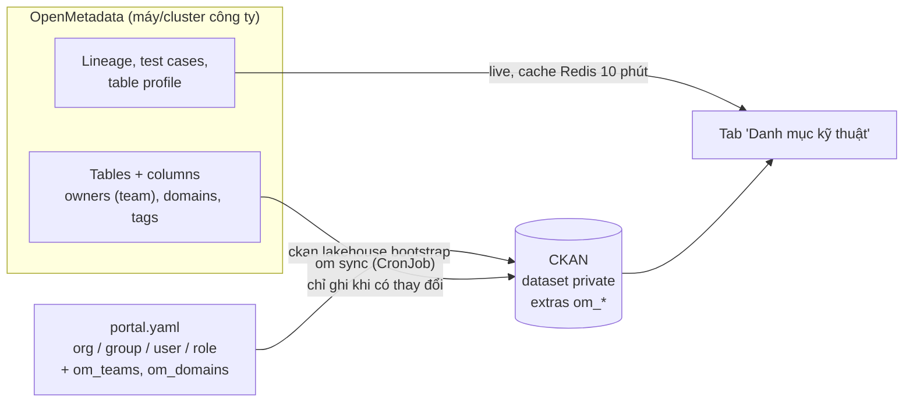

# GĐ4 — Nội dung, phân quyền và tích hợp OpenMetadata

> Hai đầu việc giao ngày 2026-10-06:
> 1. Tạo đủ organization, group, dataset và **phân quyền người dùng**.
> 2. **Kết nối OpenMetadata** và dùng dữ liệu từ OpenMetadata để hiển thị.
>
> Cả hai nằm trong extension mới [`ckanext-lakehouse`](../ckanext-lakehouse/README.md), plugin `lakehouse`. Theme `evntheme` chỉ sửa đúng chỗ cắm thêm tab.

## 4.0 Tóm tắt

| | Cách làm | Lệnh |
|---|---|---|
| Đơn vị, nhóm, người dùng, vai trò | File YAML khai báo, chạy lại an toàn | `ckan lakehouse bootstrap FILE --credentials OUT.csv [--prune]` |
| Dataset demo | Như cũ, chỉ cho local và kind | `ckan evntheme seed-demo` |
| Dataset thật | Sinh từ bảng của OpenMetadata | `ckan lakehouse om sync` (CronJob mỗi giờ ở phút 40) |
| Hiển thị OpenMetadata | Tab **Danh mục kỹ thuật** trên trang dataset, lấy live, có cache | — |
| Phát triển khi không có mạng công ty | Snapshot ghi ở máy RDP, phát lại bằng mock | `tools/openmetadata/om_snapshot.py`, `om_mock.py` |



## 4.1 Mô hình phân quyền

CKAN có ba tầng quyền. Quyền **sửa dataset luôn đi theo organization sở hữu**; group chỉ dùng để phân loại ("miền dữ liệu").

| Vai trò | Ở đâu | Được làm |
|---|---|---|
| sysadmin | toàn site | Mọi thứ, kể cả tạo org/group, tạo user |
| `admin` | organization | Thêm/bớt thành viên; tạo, sửa, xóa mọi dataset của org |
| `editor` | organization | Tạo, sửa mọi dataset của org |
| `member` | organization | **Đọc** dataset private của org |
| `admin` | group | Thêm/bớt thành viên group; gắn/gỡ dataset |
| `member` | group | Gắn/gỡ dataset **mà mình sửa được** vào group |
| đã đăng nhập, không thuộc đâu | — | Chỉ thấy dữ liệu công khai |

`editor` không áp dụng cho group (`member_roles_list` của core loại nó ra).

Cấu hình `ckan.auth.*` siết lại cho cổng nội bộ (local `ckan.ini`, `docker/.env.example`, `k8s/base/config.env`):

| Key | Giá trị | Lý do |
|---|---|---|
| `create_user_via_web` | `false` | Tài khoản do sysadmin/bootstrap tạo (Q5: chưa có SSO) |
| `user_create_organizations` | `false` | Chỉ sysadmin tạo đơn vị |
| `user_create_groups` | `false` | Chỉ sysadmin tạo miền dữ liệu. Local trước đó để `true`, tức là ai đăng nhập cũng tạo được |
| `public_user_details` | `false` | Không lộ danh sách người dùng cho khách |

### Ma trận đã kiểm chứng (local, 2026-10-06)

Bằng `check_access` của CKAN trên dữ liệu demo (`demo/portal.yaml` + 5 dataset từ OpenMetadata mock, private):

| User (vai trò) | xem bảng sự cố (A0, private) | sửa | xem doanh thu (Ban KD, private) | sửa | tạo dataset EVNNPC | sửa dataset EVNNPC | quản lý thành viên EVNNPC | quản lý thành viên miền KT-AT | tạo org | tạo group |
|---|---|---|---|---|---|---|---|---|---|---|
| `quantri-portal` (sysadmin) | ✓ | ✓ | ✓ | ✓ | ✓ | ✓ | ✓ | ✓ | ✓ | ✓ |
| `npc-quantri` (admin EVNNPC, member Ban KD) | | | ✓ | | ✓ | ✓ | ✓ | | | |
| `npc-bientap` (editor EVNNPC) | | | | | ✓ | ✓ | | | | |
| `kd-bientap` (editor Ban KD) | | | ✓ | ✓ | | | | | | |
| `ktsx-bientap` (editor Ban KTSX + A0) | ✓ | ✓ | | | | | | | | |
| `a0-thanhvien` (member A0) | ✓ | | | | | | | | | |
| `mien-ktat` (admin group KT-AT) | | | | | | | | ✓ | | |
| `nguoidung-xem`, khách | | | | | | | | | | |

Test tự động khóa lại các hành vi này: `ckanext-lakehouse/ckanext/lakehouse/tests/test_app.py`.

## 4.2 Đầu việc 1 — `ckan lakehouse bootstrap`

File mẫu: [`ckanext-lakehouse/ckanext/lakehouse/demo/portal.yaml`](../ckanext-lakehouse/ckanext/lakehouse/demo/portal.yaml), gồm 9 user hư cấu, 9 org và 5 group. Org và group trùng tên với `seed-demo`, nên 12 dataset demo rơi đúng đơn vị.

```yaml
users:
  - name: npc-bientap            # chữ thường, số, - _ (KHÔNG có dấu chấm, gotchas 30)
    fullname: "Biên tập viên EVNNPC"
    email: npc-bientap@evn.example
    sysadmin: false              # true: nâng sysadmin. Không bao giờ tự hạ
organizations:
  - name: ban-kinh-doanh
    title: "Ban Kinh doanh"
    extras: {org_type: "department", abbreviation: "KD"}
    openmetadata:                # đơn vị nhận bảng nào của OpenMetadata (4.3)
      teams: ["KinhDoanh"]       #   owner team
      fqn: ["trino_lakehouse.iceberg_curated.kinh_doanh.*"]   # hoặc mẫu FQN
    members: {kd-bientap: editor, npc-quantri: member}
groups:
  - name: ky-thuat-an-toan
    openmetadata: {domains: ["KyThuat", "VanHanh"]}            # domain OM → miền dữ liệu
    members: {mien-ktat: admin}
```

Hành vi:
- Kiểm tra cả file **trước khi ghi** (tên, email, vai trò hợp lệ).
- User mới được đặt mật khẩu ngẫu nhiên, ghi **một lần** vào file `--credentials` (quyền 600, không được tồn tại sẵn; `-` để in ra màn hình). User đã có thì **không sửa**, chỉ nâng sysadmin nếu file yêu cầu.
- Org/group: tạo mới, hoặc patch khi khác. Extras trong file là nguồn sự thật cho các key nó liệt kê.
- Vai trò: đặt đúng role khai báo. `--prune` gỡ thành viên không có trong file (khỏi những org/group file liệt kê), chừa sysadmin.
- Chạy lại lần hai: `Nothing to change.` (đã kiểm chứng).

Chạy ở từng môi trường:

```bash
# Local (WSL)
ckan -c ~/ckan/etc/ckan.ini lakehouse bootstrap \
  /mnt/c/Users/Tlinh/ckan_customized/ckanext-lakehouse/ckanext/lakehouse/demo/portal.yaml \
  --credentials ~/ckan/backup/lakehouse-users-$(date +%Y%m%d).csv

# Compose
docker compose exec -T ckan ckan -c /srv/app/ckan.ini lakehouse bootstrap - --credentials - < portal.yaml

# K8s: file đọc từ stdin, mật khẩu in ra terminal của bạn (không vào log pod)
kubectl --context <ctx> -n lakehouse exec -i deploy/ckan -- \
  ckan -c /srv/app/ckan.ini lakehouse bootstrap - --credentials - < portal.yaml
```

Cho cụm công ty: chép file mẫu ra **ngoài repo** nếu nó chứa email thật, điền đơn vị, người và vai trò thật (Q11).

## 4.3 Đầu việc 2 — Đồng bộ OpenMetadata → dataset

`ckan lakehouse om check` cho biết: phiên bản OM, số bảng token thấy được, và team/domain nào **đã/chưa** ánh xạ. Dùng lệnh này để viết phần `openmetadata:` của file bootstrap.

`ckan lakehouse om sync [--dry-run] [--allow-empty]`:

| OpenMetadata | CKAN | Ghi chú |
|---|---|---|
| Bảng có FQN khớp `om.include`, không khớp `om.exclude`, có một tag trong `om.require_tags` (nếu đặt) | 1 dataset, tên `om-<fqn đã chuẩn hóa>` | Nhận diện theo **id bảng** (`om_id`): đổi tên bảng không đổi URL |
| `displayName` / `name` | `title` | |
| `description` (markdown) | `notes` | OM để trống thì giữ mô tả biên tập viên viết |
| Owner **team** → org có `om_teams`; không có thì mẫu `om_fqn_patterns`; không có thì `om.default_org` | `owner_org` | Không org nào nhận → bỏ qua, báo trong `Skipped` |
| Domain → group có `om_domains` | group | Qua `member_create`, không qua `package_patch` (gotchas 28) |
| Tag (trừ `Tier.*`) | tag | Tag biên tập viên tự thêm được giữ |
| `Tier.TierN` | extra `om_tier` | |
| Cột | extra `om_columns` (JSON, tối đa 500) | Tìm kiếm được, và là bản dự phòng khi OM không trả lời |
| Profile mới nhất: `rowCount` | extra `record_count` | KPI "Số bản ghi" của theme |
| `serviceType · service` | extra `source_system` | **Chỉ điền khi trống** |
| Service Trino (hoặc khai báo ở `om.trino_catalogs`) | resource `jdbc:trino://…/catalog/schema` | Hiện hộp "Kết nối" của theme. Cần `om.trino_jdbc_url` |
| Bảng rời khỏi OM hoặc ra khỏi phạm vi | soft delete (`om.on_removed=delete`) | Quay lại thì **khôi phục** đúng dataset cũ |

Nguyên tắc an toàn:
- Dataset mới tạo ở chế độ **private** (`om.private=true`). Editor quyết định công bố; sync không bao giờ đổi lại `private`.
- **Chỉ ghi khi có thay đổi**: lần chạy thứ hai báo `5 unchanged`, không sinh activity rác.
- OM lỗi khi đang liệt kê bảng → không ghi gì. Phạm vi rỗng trong khi đang có dataset → **không xóa** (cần `--allow-empty`).
- Dataset tạo tay trùng tên → bỏ qua, không đè.
- Activity ghi tên user `om-sync` (`om.sync_user`, không phải sysadmin). Thiếu user này thì dùng site user (bị ẩn khỏi activity).

## 4.4 Tab "Danh mục kỹ thuật"

Tab này chỉ hiện trên dataset có `om_fqn`, đứng trước tab "Nhật ký". Nội dung gồm:
- thông tin bảng: owner, domain, Tier, số dòng, lượt truy vấn tuần, các tag;
- **kiểm định chất lượng**: test thất bại xếp đầu;
- **lineage** một bậc: nút nào là dataset CKAN mà người xem có quyền đọc thì trỏ về trang CKAN, còn lại trỏ về OM;
- danh sách cột.

- Mở thẳng `?tab=openmetadata` → render phía server (chạy cả khi không có JS). Bấm từ tab khác → `lakehouse-om-panel.js` tải `/dataset/<id>/openmetadata` lần đầu tab hiện, nên OM chậm không làm chậm trang.
- Quyền: endpoint đi qua `package_show` → dataset private trả 403 cho người ngoài (đã kiểm chứng).
- Cache Redis `om.cache_ttl` (mặc định 600 s), dùng chung giữa các worker uWSGI; lỗi chỉ cache 60 s.
- OM không trả lời → thông báo + bảng cột từ lần đồng bộ gần nhất (đã kiểm chứng bằng cách tắt mock).
- Sidebar thêm dòng **Bảng nguồn**; mọi extra `om_*` bị ẩn khỏi "Thông tin bộ dữ liệu".

## 4.5 Phát triển khi OpenMetadata chỉ vào được qua Remote Desktop

Laptop không tới được OM thật (10.1.117.91:30858 timeout, 2026-10-06). Quy trình ([tools/openmetadata/README.md](../tools/openmetadata/README.md)):

1. Trên máy công ty (RDP): `python om_snapshot.py --url <OM> --include "<mẫu FQN>" --out lakehouse.om-snapshot.json`. Token đọc từ `OM_TOKEN` (hoặc hỏi), không ghi vào file. **Không** lấy sample data, profile cột (min/max là giá trị thật), thông điệp kết quả test, tên người follow.
2. Chép file về laptop, để ngoài git (`*.om-snapshot.json` đã có trong `.gitignore` và `.dockerignore`).
3. `python3 tools/openmetadata/om_mock.py lakehouse.om-snapshot.json --port 8585 --token dev-token`, rồi trỏ `ckanext.lakehouse.om.url = http://127.0.0.1:8585`. Có `--legacy` để giả lập OM < 1.5.

Đến khi có snapshot thật thì dùng `tools/openmetadata/sample-snapshot.json`: 7 bảng **hư cấu**, phủ đủ các trường hợp (team, mẫu FQN, bảng không ai nhận, bảng raw ngoài phạm vi, test thất bại, lineage tới pipeline/dashboard).

## 4.6 Lên cụm công ty

Đã chuẩn bị sẵn trong repo:
- image `ckan-lakehouse:0.2.0` (`newTag` trong `k8s/base/kustomization.yaml`; build sạch, import kiểm trên Python 3.10);
- CronJob `ckan-om-sync`;
- các key `CKAN__AUTH__*` và `CKANEXT__LAKEHOUSE__OM__*` trong ConfigMap;
- overlay `lab` trỏ OM qua NodePort, **`OM__INCLUDE` để trống** nên sync chưa công bố gì;
- token đặt ở `CKANEXT__LAKEHOUSE__OM__API_TOKEN` trong `secrets.env` (mẫu ở `k8s/secrets.env.example`).

Thứ tự khi deploy GĐ3 (sau các bước 3.3–3.6):
1. Tạo **bot chỉ đọc** trên OM, lấy JWT, thêm vào `secrets.env` (Q12).
2. Audit tên Service của OM trong ns `lakehouse`; nếu có, đổi `OM__URL` sang địa chỉ nội bộ.
3. `exec` bootstrap với file thật (4.2).
4. `ckan lakehouse om check` → chốt `OM__INCLUDE` (và `OM__REQUIRE_TAGS` nếu muốn công bố theo tag) cùng chủ dữ liệu (Q13) → apply lại ConfigMap.
5. Chạy tay một lần: `kubectl --context <ctx> -n lakehouse create job --from=cronjob/ckan-om-sync om-sync-now`, xem log, rồi để CronJob tự chạy.

## 4.6b Tập dượt trên kind — kết quả 2026-10-06

Nâng cấp **tại chỗ** cụm `ckan-rehearsal` đang chạy `0.1.0` (có dữ liệu GĐ3) lên `0.2.0`. Cách này giống với lúc deploy GĐ4 lên cụm công ty sau GĐ3 hơn là cài mới.

```bash
docker save ckan-lakehouse:0.2.0 | gzip -1 > /tmp/ckan-0.2.0.tar.gz          # 537 MB
for n in ckan-rehearsal-worker ckan-rehearsal-worker2; do
  gunzip -c /tmp/ckan-0.2.0.tar.gz | docker exec -i $n ctr -n k8s.io images import -; done
bash k8s/overlays/kind/om-mock.sh                  # OpenMetadata giả trong cụm + token vào secrets.env
kubectl --context kind-ckan-rehearsal apply -k k8s/overlays/kind --dry-run=server
kubectl --context kind-ckan-rehearsal apply -k k8s/overlays/kind
bash k8s/overlays/kind/smoke-test-om.sh            # GĐ4: 31 kiểm tra, ~1,5 phút
bash k8s/overlays/kind/smoke-test.sh               # GĐ3 hồi quy: 47 kiểm tra, ~2 phút
```

| Bước | Kết quả |
|---|---|
| `ctr import` mỗi worker | **10–12 s** (lần đầu ~100 s): containerd dùng lại layer của `0.1.0`, chỉ thêm layer mới |
| `--dry-run=server` | Chỉ có: ConfigMap/Secret mới (hash), `ckan`/`ckan-worker`/`ckan-tracking-update` *configured*, `ckan-om-sync` *created*. PVC, Service, Solr, Redis, Postgres *unchanged* |
| Rollout (`Recreate`) | 62 s, portal 200, log không lỗi |
| `smoke-test-om.sh` | **31/31**, chạy hai lần (cụm mới nâng cấp và cụm đã có user): bootstrap qua `exec -i` + idempotent; `om check`; job từ CronJob tạo 5 / lần hai `5 unchanged`; dataset private, đúng org + group (user sync không phải sysadmin), JDBC, `record_count`, activity ghi `om-sync`; quyền 403/200 cho khách / người ngoài / thành viên; tab, lineage, sidebar; OM scale về 0 → thông báo + cột dự phòng, sync báo lỗi và không ghi gì |
| `smoke-test.sh` (GĐ3) | **47/47** trên `0.2.0`; RAM pod `ckan` 175 MiB, không đổi so với `0.1.0` |

Mock OpenMetadata trong kind (`om-mock.yaml` + `om-mock.sh`) chạy bằng chính image CKAN (có sẵn Python), đọc script và snapshot từ ConfigMap. Nó không nằm trong kustomization, vì kustomize không đọc file ngoài thư mục overlay. Gỡ bằng `bash k8s/overlays/kind/om-mock.sh kind-ckan-rehearsal --delete`.

## 4.7 Câu hỏi còn mở

- **Q11:** danh sách đơn vị, người dùng và vai trò thật.
- **Q12:** bot OM chỉ đọc và token.
- **Q13:** phạm vi bảng được công bố: mẫu FQN, tag, và việc có giữ mặc định private hay không.

Chi tiết ở [roadmap](roadmap.md#câu-hỏi-còn-mở).
