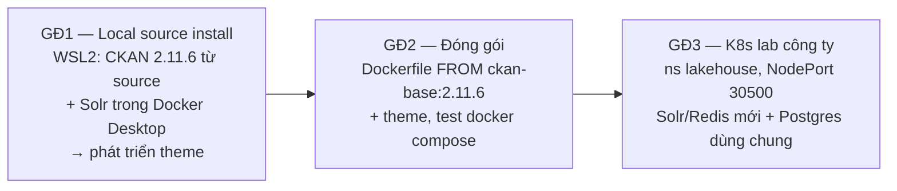

# Roadmap — CKAN 2.11 + theme riêng cho Lakehouse

> **Nguồn sự thật về tiến độ.** Agent: đọc file này đầu mỗi session; cập nhật checklist và decision log khi có thay đổi.

## Bối cảnh

Hai task được giao:
1. **Deploy CKAN from source.**
2. **Customize theme** cho CKAN.

**Phiên bản mục tiêu:** CKAN **2.11.6**, bản vá mới nhất của nhánh 2.11, phát hành 2026-08-26, tag git `ckan-2.11.6`. Dự án đã quay về bản này từ 2.12.0 ngày 2026-09-18 (Decision log).

Trong kiến trúc Lakehouse (báo cáo nội bộ, mục 11.10), CKAN là **data portal cho người dùng cuối**. Nó đứng cạnh OpenMetadata (catalog kỹ thuật) và publish các dataset tầng curated/Gold. Resource của dataset là link Trino JDBC hoặc file CSV do Airflow export qua CKAN API. Hiện trên cluster chỉ có bản stub `ckan/ckan-base:2.10` chưa nối Postgres, Solr hay Redis. Xem [cluster-context.md](cluster-context.md).

## Chiến lược: local trước, cluster sau

Lý do chọn thứ tự này:
- Theme cần sửa rất nhiều vòng. Local cho vòng lặp tính bằng giây.
- Trên K8s, mỗi vòng mất 5–10 phút vì chưa có registry: build → `ctr import` lên 2 worker → rollout.
- Cluster dùng chung, sai là ảnh hưởng người khác.
- Chưa có kubeconfig.

Code theme là một package Python, **giữ nguyên** qua cả ba giai đoạn; chỉ cấu hình thay đổi.

## Trạng thái

### Giai đoạn 1 — Local source install + theme · [chi tiết](phase-1-local-source.md)

> **2026-09-18 — quay về CKAN 2.11.6** (Decision log). Toàn bộ repo đã chuyển sang 2.11.6: docs, script, CI của extension, theme.
>
> Theme đã viết lại cho classic, vì 2.11 không có Midnight Blue.
>
> Local đã chuyển xong:
> - User chạy `setup_step2_switch_to_2.11.sh`: CKAN 2.11.6 (`pip check` sạch), Solr `2.11-solr9`, DB lên head, có `admin`. Backup DB 2.12 nằm ở `~/ckan/backup`.
> - Agent dựng lại dữ liệu mẫu (thêm dataset `demo-outage-summary`); smoke test 22/22 qua.
> - Kiểm tra theme bằng ảnh chụp:
>   - debug và prod-like;
>   - 1366px và 400px;
>   - tương phản các cặp màu chính ≥ 5.5:1.
> - Sửa những gì phát hiện: link trong tiêu đề thẻ, chữ tiếng Việt bị ngắt giữa từ, vài chuỗi dịch; `ckan-shot.ini` thêm section logging (gotchas 6s–6u).
>
> **GĐ1 xong trên 2.11.6, sẵn sàng sang GĐ2.** Còn treo, không chặn GĐ2: bộ nhận diện thật (Q2) và test cần DB.
>
> *Lịch sử 2026-09-14, trên 2.12.0:* GĐ1 đã xong phần kỹ thuật. CKAN 2.12.0 cài từ source, Solr chạy, smoke test 17/17 qua. Đã chốt Q1 (`ckanext-lakehouse_theme`), Q2 (placeholder) và Q9 (Midnight Blue). Theme làm xong checklist và đã kiểm tra ở chế độ debug lẫn prod-like, trên desktop và mobile. `setup_step1_system.sh` đã được sửa: bỏ `git-core` vì gói này không còn trên 24.04, và cho phép chạy lại nhiều lần.

- [x] WSL2 Ubuntu 24.04 sẵn sàng (Python 3.12.3, systemd bật, docker CLI trong WSL)
- [x] **User tự chạy** `setup_step1_system.sh`: cài Postgres/Redis/libmagic, tạo DB `ckan_default`, tạo `~/ckan/etc` và `~/ckan/storage` (2026-09-14; giống nhau cho 2.11 và 2.12)
- [x] Scaffold `ckanext-lakehouse_theme` trong repo, `pip install -e`, bật plugin đứng đầu `ckan.plugins` (2026-09-14)
- [x] Ghi mọi key `ckan.ini` đã đổi vào bảng config ở [phase-2](phase-2-docker-packaging.md#bảng-ánh-xạ-cấu-hình) (2026-09-14, rà lại cho 2.11 ngày 2026-09-18)
- [x] Chuyển repo sang 2.11.6 (2026-09-18):
  - docs;
  - `setup_step2_switch_to_2.11.sh`;
  - CI extension dùng `ckan-dev:2.11`;
  - Q9 → classic;
  - theme viết lại cho classic, thêm helper `lakehouse_theme_recent_datasets`, unit test 9/9.
- [x] **User tự chạy** `setup_step2_switch_to_2.11.sh` ([phase-1 bước 1.1b](phase-1-local-source.md#bước-11b--chuyển-bản-cài-2120-sang-2116-user-tự-chạy-không-cần-sudo)) (2026-09-18). Script đã làm:
  - venv mới với CKAN **2.11.6** từ source;
  - sinh lại `ckan.ini` bằng 2.11, user tự điền mật khẩu DB;
  - Solr `ckan/ckan-solr:2.11-solr9`;
  - backup rồi xóa schema 2.12, sau đó `db init` + `db upgrade -p activity`;
  - tạo sysadmin `admin`.
- [x] Smoke test lại trên 2.11.6, qua API, 22/22 (2026-09-18):
  - `status_show` báo 2.11.6;
  - org `lakehouse-demo`;
  - dataset `demo-curated-orders` (CSV upload tải về khớp nội dung, URL `jdbc:trino://…`) và `demo-outage-summary`;
  - tìm kiếm `orders`, `đơn hàng`, `tags:gold`;
  - 10 trang web trả 200 và có marker của theme;
  - ô tìm kiếm header bị ẩn ở `/` và `/dataset/`.

  Token API tạm (`user token add`) đã thu hồi.
- [x] Kiểm tra theme classic bằng ảnh chụp headless Chrome (2026-09-18):
  - chế độ debug (:5000) và prod-like (:5002);
  - bề rộng 1366px và 400px;
  - trang chủ, `/dataset/`, resource Trino, `/organization/`;
  - tương phản các cặp màu chính từ 5.54:1 trở lên.

  Đã sửa:
  - link "Xem tất cả" bị lệch vì clearfix trong flex (gotchas 6t);
  - mô tả org bị ngắt giữa từ (6u);
  - "số bộ dữ liệu tìm thấy" / "Member" chưa dịch hoặc dịch vụng;
  - thiếu section logging trong `ckan-shot.ini` (6s).

### Theme "Cổng dữ liệu EVN" (2026-09-19) · [README extension](../ckanext-evntheme/README.md)

> User đưa mockup riêng (`CKAN Custom Theme UI Mockup/handoff/`: HTML + prompt + ảnh chụp), thay giao diện teal của `lakehouse_theme`.
>
> Đã làm extension mới **`ckanext-evntheme`**. Theme cũ `ckanext-lakehouse_theme` đã xóa ngày 2026-09-20 theo đồng ý của user; code vẫn còn trong lịch sử git.
>
> Đã chụp màn hình để so với mockup ở 1440px và 390px, thêm trạng thái đã đăng nhập. Không trang nào tràn ngang.
>
> Còn chờ:
> - logo EVN chính thức: hiện là placeholder. Sysadmin tải lên (PNG/JPG/GIF/WebP) ở `/ckan-admin/config`, không cần build lại;
> - DataStore (Q4): script đã sẵn sàng, chưa chạy;
> - test ứng dụng chạy trong CI / DB test.

- [x] Extension `ckanext-evntheme`, gồm:
  - token màu, font Nunito tự host;
  - header/footer mới;
  - trang chủ;
  - tìm kiếm với facet checkbox, chip lọc, dạng lưới;
  - chi tiết 4 tab: Tổng quan, Xem trước (bảng, biểu đồ, bản đồ), Thử API, Nhật ký;
  - danh bạ tổ chức và trang tổ chức;
  - trang miền dữ liệu (group);
  - Trang **Danh mục chuẩn** `/mds` có bảng riêng (`mds_*`, migration `-p evntheme`), xuất CSV/JSON, CLI `ckan evntheme mds load|export`.
- [x] Chỉ dùng số liệu thật; khối nào thiếu dữ liệu thì ẩn:
  - lượt tải và lượt xem lấy từ plugin `tracking` (bật ở local);
  - chu kỳ, chất lượng, loại dữ liệu lấy từ extras;
  - "công bố đúng hạn" tính từ chu kỳ và `metadata_modified`;
  - số liệu API lấy qua `api_metrics_url`.
- [x] Tương phản: mọi cặp chữ trong mockup dưới 4.5:1 được làm đậm vừa đủ (token "ink" trong `_tokens.scss`). Từ 2026-09-21 thang chữ phụ đậm thêm một bậc (`--evn-muted*` ≈ 6.5–7.6:1, `--evn-icon` 5.2:1) và nút CTA chuyển từ cam sang xanh `--evn-blue` (Decision log).
- [x] i18n: msgid tiếng Anh, `.po` tiếng Việt dịch 291/291 chuỗi (gồm cả chuỗi core còn thiếu).
- [x] Local:
  - `ckan.plugins = evntheme activity tracking text_view image_view`, site title/description/favicon mới;
  - `db upgrade -p tracking` và `-p evntheme`;
  - dữ liệu demo: `ckan evntheme seed-demo` với 5 miền, 9 đơn vị, 12 dataset, 10 danh mục chuẩn.

  Đã backup `ckan.ini` vào `~/ckan/backup/`.
- [x] Test: `test_units.py` 27/27 qua ở local. `test_app.py` gồm render trang, tab, MDS, export, upload logo, chỉ chạy trong CI vì cần `ckan_test`. Ruff sạch.
- [x] Logo nhận mọi định dạng ảnh qua `ckan.site_logo` của core: upload ở `/ckan-admin/config` hoặc trỏ path/URL. Khung logo cao cố định, rộng theo file. Đã thử ở local: JPG, PNG lên được, SVG bị chặn; header và footer đổi theo; mobile 390px không tràn (2026-09-19)
- [x] CI ở `.github/workflows/evntheme.yml`, đặt ở gốc repo vì workflow trong thư mục con chưa từng chạy (gotchas 6ag).
- [x] `setup_step2_switch_to_2.11.sh` đổi sang evntheme. Thêm `setup_step3_datastore.sh` (user tự chạy, cần sudo) để bật DataStore + XLoader 2.5.0 và tạo DB test.
- [ ] Thay logo placeholder bằng logo EVN thật (Q2)
- [x] **DataStore + XLoader bật ở local (2026-09-22)**: user chạy `setup_step3_datastore.sh` rồi `xloader submit all`. Kiểm chứng: `datastore_default` có **12 bảng**, 12/32 resource `datastore_active` (12 CSV; 20 resource còn lại là link XLSX/JSON/API/GeoJSON/PDF/JDBC không có file). Tab **Xem trước** hiện bảng dữ liệu thật, tab **Thử API** trả JSON từ `datastore_search`, console 0 lỗi. Script phải sửa 4 lỗi trong quá trình chạy — xem gotchas 6aj–6am.
- [x] Xóa `ckanext-lakehouse_theme` (2026-09-20), theo thứ tự:
  - `pip uninstall` khỏi venv;
  - xóa thư mục (37 file đã có trong git, còn lại chỉ là `__pycache__`, `.mo`, `egg-info`);
  - backup `ckan.ini`, bỏ key sót `ckanext.lakehouse_theme.openmetadata_url`;
  - restart, smoke test 23/23.

  Muốn lấy lại: `git checkout 3d7a3a5 -- ckanext-lakehouse_theme`.

### Giai đoạn 2 — Đóng gói Docker · [chi tiết](phase-2-docker-packaging.md)
- [ ] `.gitignore` (bỏ qua `.env`, `secrets.env`, `*.kubeconfig`, `ckan.ini`, `*.tar*`)
- [ ] `docker/Dockerfile` (FROM `ckan/ckan-base:2.11.6` + theme)
- [ ] `docker/compose.yaml` + `.env.example` (db, solr, redis, ckan)
- [ ] Build `ckan-lakehouse:<version>`, `docker compose up`, theme hiển thị đúng
- [ ] Kiểm tra sau khi restart vẫn còn dữ liệu, session và API token
- [ ] `docker save` ra tarball cho GĐ3

### Giai đoạn 3 — K8s lab công ty · [chi tiết](phase-3-k8s-deploy.md)
- [ ] Nhận kubeconfig (lưu **ngoài** repo)
- [ ] Audit read-only, ghi kết quả vào [cluster-context.md](cluster-context.md)
- [ ] Chốt với chủ cluster: xử lý stub `ckan`/`ckan-service`, tạo DB trên `postgres-service`
- [ ] Import image lên 2 worker (hoặc push registry nếu infra có)
- [ ] Apply manifest `k8s/`: Solr, Redis, CKAN (+ worker nếu cần)
- [ ] Verify tại http://10.1.117.91:30500 và tạo sysadmin
- [ ] Tích hợp: Airflow publish qua API, link Trino, đồng bộ OpenMetadata (sau go-live)

## Decision log

| Ngày | Quyết định | Lý do |
|---|---|---|
| 2026-09-11 | ~~CKAN 2.11.6 → CKAN 2.12.0~~ (**bị thay** bởi quyết định 2026-09-18) | 2.12.0 là bản stable mới nhất. Cài mới hoàn toàn, chưa cài bản 2.11 nào nên không cần nâng cấp |
| 2026-09-11 | Local dev dùng **WSL2 source install**, Solr chạy bằng Docker Desktop | Đúng nghĩa "from source". Image Solr của CKAN có sẵn schema |
| 2026-09-11 | Mọi thứ local đặt dưới `~/ckan/`, không dùng `/usr/lib/ckan`, `/etc/ckan` như docs gốc | Không cần sudo mỗi lần |
| 2026-09-11 | Code theme nằm trong repo này (`/mnt/c/...`), cài bằng `pip install -e` vào venv WSL | Quản lý phiên bản và sửa được từ VS Code phía Windows. Nếu chậm hoặc reloader không nhận thay đổi thì chuyển repo vào `~` |
| 2026-09-11 | Image production dùng `FROM ckan/ckan-base:<bản CKAN đang dùng>` + theme, hiện là `2.11.6` (ban đầu `2.12.0`). Không dùng Helm chart cộng đồng | Cluster đang quản lý bằng raw YAML + kubectl. Chart cộng đồng không chính thức |
| 2026-09-11 | Trên K8s **dùng lại `postgres-service`** với DB/user riêng. Solr và Redis dựng mới, riêng cho CKAN | Theo pattern đã có (OpenMetadata, mục 7.2.3) |
| 2026-09-11 | Expose bằng **NodePort 30500**, `ckan.site_url = http://10.1.117.91:30500` | Không có Ingress/LB. Giữ đúng cổng trong báo cáo |
| 2026-09-14 | ~~**Q9 → Midnight Blue**: `ckan.base_templates_folder = templates-midnight-blue`, `ckan.base_public_folder = public-midnight-blue`~~ (**bị thay** 2026-09-18: 2.11 không có Midnight Blue) | User chọn sau khi xem song song classic (:5000) và Midnight Blue (:5001) với cùng dữ liệu. Giao diện hiện đại hơn, là mặc định từ CKAN 3.0. Đổi lại: header không có ô tìm kiếm, nhiều chuỗi chưa có bản dịch `vi` (theme tự bù), extension bên thứ ba phải có template Midnight Blue (Q10) |
| 2026-09-14 | **Q1 → `ckanext-lakehouse_theme`**, plugin `lakehouse_theme`, chỉ chứa theme | Theo mặc định. Logic nghiệp vụ sau này (API, tích hợp Trino/Airflow) tách thành extension riêng |
| 2026-09-14 | **Q2 → placeholder**: logo dạng chữ, màu gom vào CSS custom properties | Chưa có bộ nhận diện chính thức. Khi có, chỉ cần thay file logo và vài biến màu |
| 2026-09-14 | Bản dịch theme: **commit `.po`, không commit `.mo`**; `.mo` build bằng `pybabel compile` ở local và trong Dockerfile | Tránh file nhị phân bị cũ so với `.po`. Babel có sẵn trong image vì là dependency của CKAN |
| 2026-09-14 | Nội dung footer (tên đơn vị, email, URL OpenMetadata, URL tài liệu Trino) là **config key `ckanext.lakehouse_theme.*`**, không hard-code | Đổi theo môi trường bằng env var trên K8s mà không phải build lại image |
| 2026-09-11 | Storage `local-path` RWO nên CKAN chạy **1 replica**, `strategy: Recreate`. Upload lưu trên PVC trước; MinIO để sau | Không có RWX. Từ 2026-09-18: 2.11 không có tầng `ckan.files.*`, nên MinIO phải qua extension upload S3 kiểu `IUploader` thay cho `ckanext-file-keeper-cloud` (chỉ 2.12); chọn khi làm (Q10) |
| 2026-09-18 | **Quay về CKAN 2.11.6** cho mọi thứ: source tag `ckan-2.11.6`, `ckan/ckan-base:2.11.6` (Python 3.10), `ckan/ckan-solr:2.11-solr9`, CI extension `ckan/ckan-dev:2.11` | User quyết định sau khi cân nhắc; chưa ghi lý do chi tiết. Đổi lại mất: Midnight Blue, tầng file `ckan.files.*`, `ckan db check`. 2.11.6 phát hành cùng ngày với 2.12.0 và có 8 bản vá bảo mật |
| 2026-09-18 | **Q9 → classic**. Theme viết lại block và CSS cho classic 2.11 (Bootstrap 5.1.3) | 2.11 chỉ nhận `templates` / `public`. Đặt Midnight Blue thì CKAN không khởi động (gotchas 6i) |
| 2026-09-18 | Trang chủ classic: hero có số dataset/tổ chức; dải dưới hero có cột trái "Bộ dữ liệu mới cập nhật" (helper `lakehouse_theme_recent_datasets`), cột phải org và nhóm nổi bật | Giữ lại những phần Midnight Blue có sẵn mà classic không có, bằng override ít block nhất (`featured_group`, `featured_organization`) |
| 2026-09-18 | Local chuyển bằng **cài lại sạch** (backup `pg_dump` → `db clean` → `db init`), không dùng `db downgrade` | Hạ schema cần code 2.12 và mật khẩu DB, mà `ckan.ini` đã mất mật khẩu. DB chỉ có dữ liệu mẫu, dựng lại được qua API (gotchas 6q) |
| 2026-09-18 | Đổi local cũng làm qua **script do user chạy** (`setup_step2_switch_to_2.11.sh`), không để agent làm | Có bước xóa venv/DB/volume Solr (agent bị chặn) và bước cần mật khẩu (DB, admin) |
| 2026-09-19 | **Theme mới `ckanext-evntheme`** (plugin `evntheme`) theo mockup của user, thay `lakehouse_theme` trong `ckan.plugins`. Hộp kết nối Trino chuyển sang theme mới | User chọn: prompt mockup đặt tên này; theme cũ giữ lại tới khi user cho xóa |
| 2026-09-19 | Số liệu **chỉ lấy từ nguồn thật, thiếu thì ẩn**, không hard-code số của mockup | User chọn. Nguồn: tracking, extras, `package_search`, bảng MDS, `api_metrics_url` |
| 2026-09-19 | Tab Xem trước / Thử API dựng sẵn trên `datastore_search`, **DataStore bật sau** bằng `setup_step3_datastore.sh`. Khi chưa có DataStore thì tab Xem trước hiện empty state, tab Thử API dùng `package_show` | User chọn (Q4) |
| 2026-09-19 | Bật plugin core **`tracking`** | Nguồn thật cho "lượt tải", "Xem nhiều nhất" và lượt tải của đơn vị |
| 2026-09-19 | "Miền dữ liệu" = **CKAN group**, thứ tự theo `ckanext.evntheme.domain_groups`. "Loại dữ liệu" = extra `data_type`, facet thẳng trên field string cùng tên (gotchas 6x) | Không cần ckanext-scheming, không phải sửa schema Solr |
| 2026-09-19 | Danh mục chuẩn dùng **bảng riêng** `mds_catalog/code/version/consumer` (Alembic của extension), nạp bằng CLI JSON; chưa có UI quản trị | Theo prompt; tách `mds/service.py` để sau này đổi sang dịch vụ MDS riêng không phải sửa template |
| 2026-09-21 | Nút CTA **cam → xanh** (`--evn-cta: #0b5aa2`, hover `#094c89`): 4 nút `.evn-btn--cta` (tìm kiếm hero, thanh tìm kiếm, "Tải tất cả", nút tài liệu API). Cam chỉ còn là màu trang trí; thêm `--evn-cta-warm` cho badge thông báo | User yêu cầu. Chỉ sửa token, không đụng template |
| 2026-09-21 | Thang chữ phụ **đậm thêm một bậc**: `--evn-muted` `#5f6a72→#4a545b`, `--evn-muted-b` `→#4f555a`, `--evn-muted-2` `→#554f46`, `--evn-muted-3` `→#5a5248`, `--evn-icon` `→#6b6152`, `--evn-on-dark` `.72→.86`. **Placeholder không nằm trong thang này**: token riêng `--evn-placeholder: #6e7378` (4.1:1), cố tình nhạt vì là gợi ý chứ không phải nội dung; chỉ pin lại để các trình duyệt hiển thị giống nhau | User phản hồi chữ nhỏ bị xám khó đọc, nhưng chốt placeholder để xám. Mức cũ chỉ vừa đạt AA (4.6–5.4:1); mức mới 6.5–7.6:1 vẫn giữ phân cấp với `--evn-ink` (11.7:1) |
| 2026-09-19 | Màu chữ làm đậm cho **đạt WCAG AA**, lệch hex mockup ở các cặp chưa đạt (CTA cam `#b95b17`, meta `#6f685e`…). Màu nền và trang trí giữ nguyên hex của mockup | Prompt yêu cầu ≥ 4.5:1 và "tăng độ đậm nếu không đạt". Muốn đổi thì sửa một token |
| 2026-09-19 | Font Nunito / Nunito Sans **tự host** (subset vietnamese, latin, latin-ext); Chart.js và Leaflet vendored, chỉ nạp khi mở tab | Cluster nội bộ có thể không ra được Internet |
| 2026-09-19 | i18n: **msgid tiếng Anh**, bản dịch vi trong `.po` | Giữ được locale `en` (`ckan.locales_offered = vi en`), đúng quy ước CKAN |
| 2026-09-19 | **Logo = `ckan.site_logo` của core**, bỏ key `ckanext.evntheme.logo_url`. Sysadmin upload PNG/JPEG/GIF/WebP ở `/ckan-admin/config` (theme khai báo bù `ckan.upload.admin.*`, gotchas 6ai), hoặc trỏ path/URL trong ini/env (dùng được cả SVG). Khi vẫn là mặc định của CKAN thì dùng placeholder của theme | User muốn nhận PNG/JPG hoặc mọi định dạng. Chỉ một key, đổi logo không phải build lại image. File upload nằm trên PVC storage |
| 2026-09-20 | **Xóa `ckanext-lakehouse_theme`**. Hai link footer của nó (OpenMetadata, hướng dẫn Trino JDBC) chưa chuyển sang evntheme vì mockup không có, chờ user quyết | User đồng ý xóa. Theme đã tắt từ 2026-09-19 và evntheme không phụ thuộc vào nó |
| 2026-09-20 | Hai link đó vào cột "Nhà phát triển" của footer evntheme, sau "Tài liệu kỹ thuật": key `ckanext.evntheme.openmetadata_url` (mặc định trống, vì IP khác theo môi trường) và `trino_docs_url` (mặc định docs Trino JDBC). Để trống thì ẩn | User chọn. Giữ nguyên cách làm của theme cũ: link là config, đổi bằng env var trên K8s |
| 2026-09-22 | Extension bên thứ ba cài **từ source bằng `pip install -e`**, không dùng wheel từ PyPI. Áp dụng cho cả local lẫn Dockerfile GĐ2 | Bản cài editable của `ckan` và theme sinh `*-nspkg.pth`, tạo sẵn module `ckanext` trong `sys.modules` nên `site-packages/ckanext/*` thành vô hình: wheel cài xong vẫn `ModuleNotFoundError` (gotchas 6ak). Cách này cũng trùng với ckan-docker và với lý do template/asset (bẫy 15) |
| 2026-09-19 | Khung logo **cao cố định (44px header / 40px footer), rộng theo file**, tối đa 176px (88px trên mobile), token `--evn-logo-*`. Lệch mockup (ô vuông 44×44) chỉ khi logo không vuông | Logo ngang trong ô vuông co còn 44×18px, không đọc được. Logo vuông vẫn giống hệt mockup |

## Câu hỏi còn mở

| # | Câu hỏi | Ai trả lời | Mặc định nếu chưa có câu trả lời |
|---|---|---|---|
| Q1 | ~~Tên theme/extension?~~ | User | ~~`ckanext-lakehouse_theme` (2026-09-14)~~ → **`ckanext-evntheme`, plugin `evntheme` (2026-09-19)** |
| Q2 | Bộ nhận diện: logo, màu, font, favicon, nội dung footer? | User / công ty | **Màu, font, bố cục và nội dung đã có từ mockup (2026-09-19)**, gom trong `_tokens.scss` và config `ckanext.evntheme.*`. Còn chờ **file logo EVN chính thức** (đang dùng placeholder; PNG/JPG/SVG đều được, xem README mục Logo) |
| Q3 | "Deploy" có nghĩa là chạy trên cluster công ty cho mọi người dùng? | Người giao task | Có, nên GĐ3 là bắt buộc |
| Q4 | ~~Có cần DataStore + xloader (preview dữ liệu, Data API)?~~ **Đóng 2026-09-22** | User | **Có (2026-09-19), đã bật xong ở local (2026-09-22)**: XLoader 2.5.0 cài **editable từ source** (`~/ckan/default/src/ckanext-xloader`, bắt buộc — gotchas 6ak), 12 CSV đã nạp vào DataStore. GĐ2 phải đưa `datastore xloader datatables_view` vào image, thêm DB `datastore_default` trong compose và một service chạy `ckan jobs worker`; GĐ3 thêm DB trên `postgres-service` + Deployment worker |
| Q5 | Có cần metadata schema riêng (ckanext-scheming), DCAT, SSO/LDAP? | User | Chưa |
| Q6 | Ngôn ngữ mặc định `vi` hay `en`? | User | `ckan.locale_default = vi`, cho phép chọn `en` |
| Q7 | Kubeconfig, quyền (`auth can-i`), registry nội bộ? | Infra | Chờ. Không có registry thì import tarball |
| Q8 | Ai sở hữu stub `ckan` trên cluster, được xóa hoặc thay không? | Chủ cluster | Không động vào khi chưa hỏi |
| Q9 | ~~Theme dựa trên classic hay Midnight Blue?~~ | User, sau khi xem thử cả hai ở GĐ1 | ~~Midnight Blue (2026-09-14)~~ → **classic (2026-09-18)**, vì 2.11 chỉ có classic. Cân nhắc lại nếu sau này lên 2.12+ |
| Q10 | Extension bên thứ ba cần dùng có hỗ trợ 2.11 không, bản nào? | Agent kiểm tra khi chốt Q4/Q5 | Kiểm tra README/CHANGELOG/CI của từng extension; ghim bản cuối còn hỗ trợ 2.11 |
