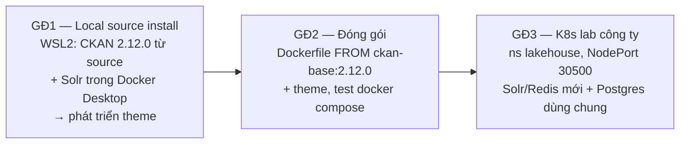

# Roadmap — CKAN 2.12 + theme riêng cho Lakehouse

> **Nguồn sự thật về tiến độ.** Agent: đọc file này đầu mỗi session; cập nhật checklist và decision log khi có thay đổi.

## Bối cảnh

Hai task được giao:
1. **Deploy CKAN from source.**
2. **Customize theme** cho CKAN.

**Phiên bản mục tiêu:** CKAN **2.12.0**, bản stable mới nhất, phát hành 2026-08-26, tag git `ckan-2.12.0`.

Trong kiến trúc Lakehouse (báo cáo nội bộ, mục 11.10), CKAN là **data portal cho người dùng cuối**. Nó đứng cạnh OpenMetadata (catalog kỹ thuật) và publish các dataset tầng curated/Gold. Resource của dataset là link Trino JDBC hoặc file CSV do Airflow export qua CKAN API. Hiện trên cluster chỉ có bản stub `ckan/ckan-base:2.10` chưa nối Postgres, Solr hay Redis. Xem [cluster-context.md](cluster-context.md).

## Chiến lược: local trước, cluster sau

Lý do chọn thứ tự này:
- Theme cần sửa rất nhiều vòng. Local cho vòng lặp tính bằng giây.
- Trên K8s, mỗi vòng mất 5–10 phút vì chưa có registry: build → `ctr import` lên 2 worker → rollout.
- Cluster dùng chung, sai là ảnh hưởng người khác.
- Chưa có kubeconfig.

Code theme là một package Python, **giữ nguyên** qua cả ba giai đoạn; chỉ cấu hình thay đổi.

## Trạng thái

### Giai đoạn 1 — Local source install + theme · [chi tiết](phase-1-local-source.md)

> **Audit 2026-09-14:** GĐ1 mới xong 2/12 mục. Chưa có Postgres/Redis/libmagic, chưa có `~/ckan/etc`, `~/ckan/storage`, CKAN hay `ckanext-*`. WSL Integration của Docker Desktop đã bật (xác nhận `docker ps` chạy được trong Ubuntu). Đã sửa `setup_step1_system.sh`: bỏ `git-core` vì không còn trên 24.04 và làm script fail, cho phép chạy lại nhiều lần. `ckan-2.12.0` vẫn là tag mới nhất. Sau đó (cùng ngày): script đã chạy xong, CKAN 2.12.0 đã cài, Solr chạy, `ckan.ini` đã sinh và chỉnh các key không bí mật. **Đang chờ user điền mật khẩu vào `sqlalchemy.url`, rồi `db init` + `sysadmin add`.**

- [x] WSL2 Ubuntu 24.04 sẵn sàng (Python 3.12.3, systemd bật, docker CLI trong WSL)
- [x] Tạo venv `~/ckan/default` (còn trống, chưa cài CKAN)
- [x] **User tự chạy** `setup_step1_system.sh`: cài Postgres/Redis/libmagic, tạo DB `ckan_default`, tạo `~/ckan/etc` và `~/ckan/storage` (2026-09-14)
- [x] `pip install` CKAN **2.12.0** từ source vào venv: clone tag rồi `pip install -e "…/src/ckan[requirements]"`, `pip check` sạch (2026-09-14)
- [x] Container Solr `ckan/ckan-solr:2.12-solr9`: `ckan-solr` chạy ở cổng 8983, ping core `ckan` trả OK (2026-09-14)
- [x] Sinh và chỉnh `~/ckan/etc/ckan.ini`; cài thêm `dev-requirements.txt` (bắt buộc khi `debug = true`) (2026-09-14)
- [x] `db init` + `db upgrade -p activity`: schema lõi và activity đều đã lên head (2026-09-14)
- [ ] `db init` → sysadmin → `ckan run` → truy cập được http://localhost:5000
- [ ] Smoke test: tạo organization, dataset, upload resource, tìm kiếm ra dataset
- [ ] So sánh theme gốc classic và **Midnight Blue**, chốt Q9
- [ ] Scaffold `ckanext-<theme>` trong repo, `pip install -e`, bật plugin
- [ ] Làm theme theo checklist trong [ckan-theming.md](ckan-theming.md#checklist-theme-dự-kiến)
- [ ] Ghi mọi key `ckan.ini` đã đổi vào bảng config ở [phase-2](phase-2-docker-packaging.md#bảng-ánh-xạ-cấu-hình)

### Giai đoạn 2 — Đóng gói Docker · [chi tiết](phase-2-docker-packaging.md)
- [ ] `.gitignore` (bỏ qua `.env`, `secrets.env`, `*.kubeconfig`, `ckan.ini`, `*.tar*`)
- [ ] `docker/Dockerfile` (FROM `ckan/ckan-base:2.12.0` + theme)
- [ ] `docker/compose.yaml` + `.env.example` (db, solr, redis, ckan)
- [ ] Build `ckan-lakehouse:<version>`, `docker compose up`, theme hiển thị đúng
- [ ] Kiểm tra sau khi restart vẫn còn dữ liệu, session và API token
- [ ] `docker save` ra tarball cho GĐ3

### Giai đoạn 3 — K8s lab công ty · [chi tiết](phase-3-k8s-deploy.md)
- [ ] Nhận kubeconfig (lưu **ngoài** repo)
- [ ] Audit read-only, ghi kết quả vào [cluster-context.md](cluster-context.md)
- [ ] Chốt với chủ cluster: xử lý stub `ckan`/`ckan-service`, tạo DB trên `postgres-service`
- [ ] Import image lên 2 worker (hoặc push registry nếu infra có)
- [ ] Apply manifest `k8s/`: Solr, Redis, CKAN (+ worker nếu cần)
- [ ] Verify tại http://10.1.117.91:30500 và tạo sysadmin
- [ ] Tích hợp: Airflow publish qua API, link Trino, đồng bộ OpenMetadata (sau go-live)

## Decision log

| Ngày | Quyết định | Lý do |
|---|---|---|
| 2026-09-11 | ~~CKAN 2.11.6~~ → **CKAN 2.12.0**, thống nhất cho mọi thứ: source tag, `ckan-base:2.12.0`, `ckan-solr:2.12-solr9` | 2.12.0 là bản stable mới nhất. Cài mới hoàn toàn, chưa cài bản 2.11 nào nên không cần nâng cấp |
| 2026-09-11 | Local dev dùng **WSL2 source install**, Solr chạy bằng Docker Desktop | Đúng nghĩa "from source". Image Solr của CKAN có sẵn schema |
| 2026-09-11 | Mọi thứ local đặt dưới `~/ckan/`, không dùng `/usr/lib/ckan`, `/etc/ckan` như docs gốc | Không cần sudo mỗi lần |
| 2026-09-11 | Code theme nằm trong repo này (`/mnt/c/...`), cài bằng `pip install -e` vào venv WSL | Quản lý phiên bản và sửa được từ VS Code phía Windows. Nếu chậm hoặc reloader không nhận thay đổi thì chuyển repo vào `~` |
| 2026-09-11 | Image production dùng `FROM ckan/ckan-base:2.12.0` + theme. Không dùng Helm chart cộng đồng | Cluster đang quản lý bằng raw YAML + kubectl. Chart cộng đồng không chính thức |
| 2026-09-11 | Trên K8s **dùng lại `postgres-service`** với DB/user riêng. Solr và Redis dựng mới, riêng cho CKAN | Theo pattern đã có (OpenMetadata, mục 7.2.3) |
| 2026-09-11 | Expose bằng **NodePort 30500**, `ckan.site_url = http://10.1.117.91:30500` | Không có Ingress/LB. Giữ đúng cổng trong báo cáo |
| 2026-09-11 | Storage `local-path` RWO nên CKAN chạy **1 replica**, `strategy: Recreate`. Upload lưu trên PVC trước; MinIO để sau, qua `ckanext-file-keeper-cloud` (adapter `ckan:s3`, **chỉ hỗ trợ 2.12**) | Không có RWX. 2.12 có tầng file storage mới (`ckan.files.*`) |

## Câu hỏi còn mở

| # | Câu hỏi | Ai trả lời | Mặc định nếu chưa có câu trả lời |
|---|---|---|---|
| Q1 | Tên theme/extension? | User | `ckanext-lakehouse_theme`, plugin `lakehouse_theme` |
| Q2 | Bộ nhận diện: logo, màu, font, favicon, nội dung footer? | User / công ty | Dùng placeholder, gom biến màu về một chỗ |
| Q3 | "Deploy" có nghĩa là chạy trên cluster công ty cho mọi người dùng? | Người giao task | Có, nên GĐ3 là bắt buộc |
| Q4 | Có cần DataStore + xloader (preview dữ liệu, Data API)? | User | Không bật ở mốc đầu, thêm sau GĐ2 |
| Q5 | Có cần metadata schema riêng (ckanext-scheming), DCAT, SSO/LDAP? | User | Chưa |
| Q6 | Ngôn ngữ mặc định `vi` hay `en`? | User | `ckan.locale_default = vi`, cho phép chọn `en` |
| Q7 | Kubeconfig, quyền (`auth can-i`), registry nội bộ? | Infra | Chờ. Không có registry thì import tarball |
| Q8 | Ai sở hữu stub `ckan` trên cluster, được xóa hoặc thay không? | Chủ cluster | Không động vào khi chưa hỏi |
| Q9 | Theme dựa trên bộ template classic (mặc định của 2.12) hay **Midnight Blue** (sẽ thành mặc định từ CKAN 3.0)? | User, sau khi xem thử cả hai ở GĐ1 | **Midnight Blue**: tránh phải làm lại theme khi lên 3.0. Quay về classic nếu extension cần dùng hiển thị lỗi |
| Q10 | Extension bên thứ ba cần dùng đã hỗ trợ 2.12 chưa? | Agent kiểm tra khi chốt Q4/Q5 | Kiểm tra README/CHANGELOG/CI của từng extension trước khi cài |
